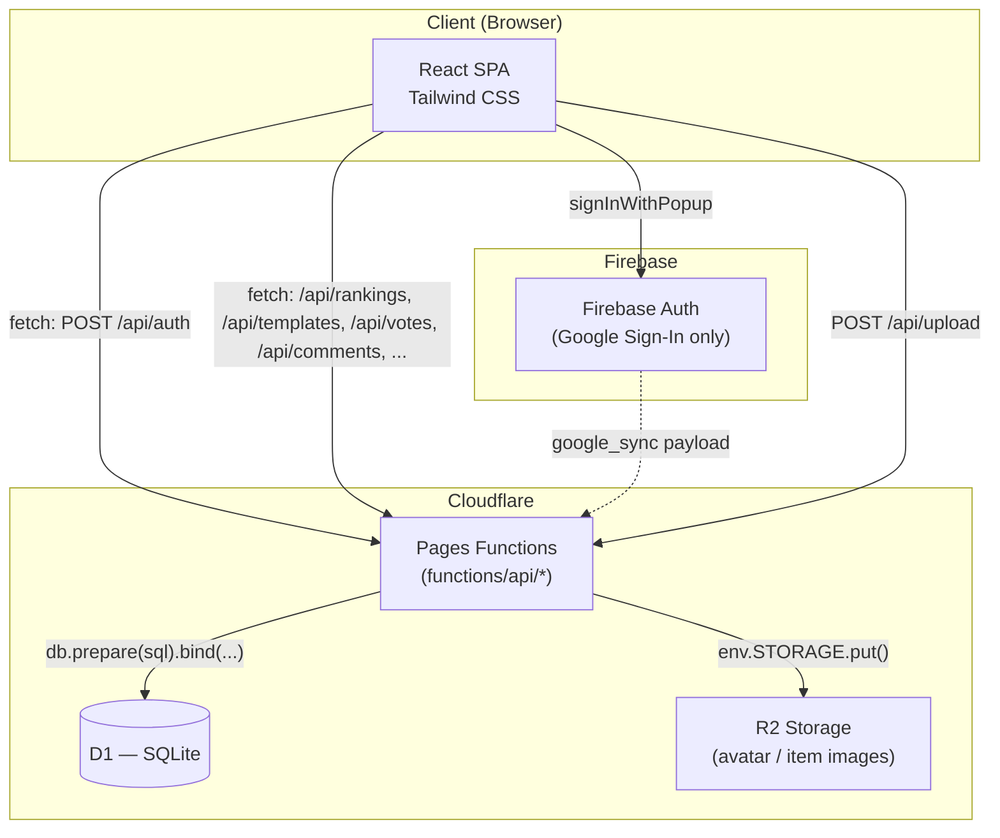
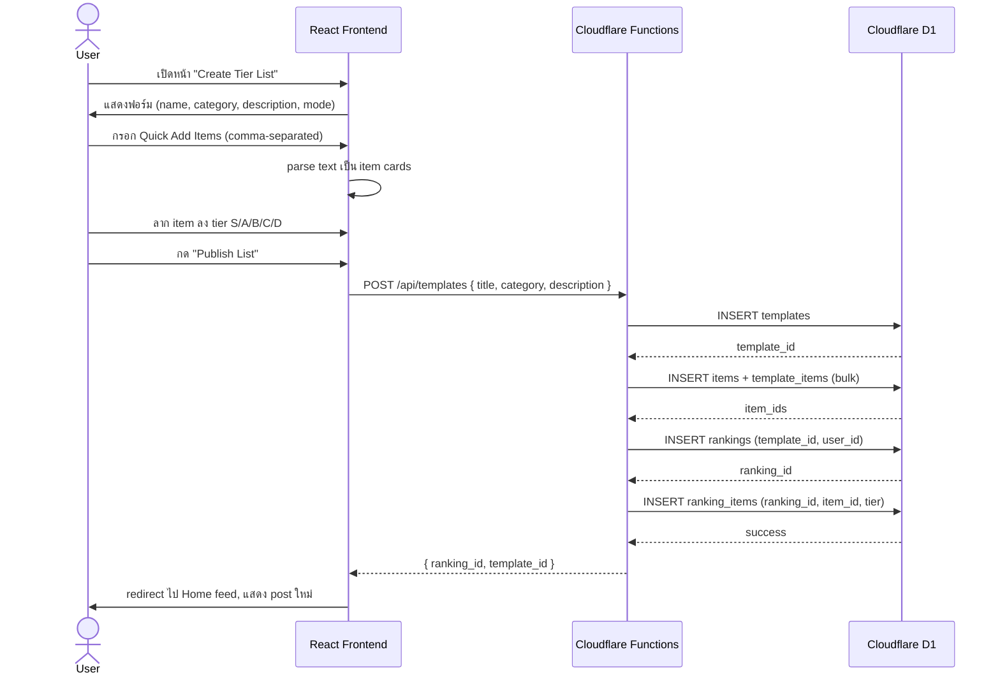
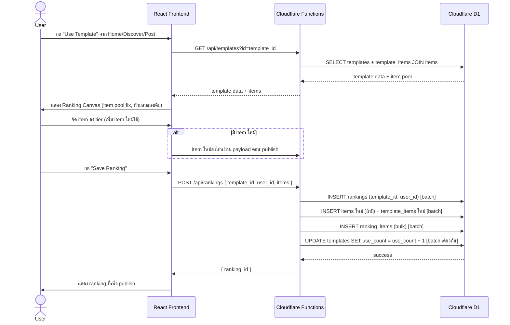

# Software Design Specification: Tear of God

**Social Platform for Creating and Ranking Tier Lists**
(แพลตฟอร์มโซเชียลสำหรับการสร้างและจัดอันดับเทียร์ลิสต์)

| | |
|---|---|
| **Advisor** | ดร. ณัฐพล หาญสมุทร |
| **Team** | 67025044 รินรพัชร แสนคำ · 67022928 สมพล หยดย้อย · 67023019 อภิทรัพย์ ภาระหันต์ |
| **Version** | 1.0 |
| **Date** | 16 July 2026 |
| **Status** | Draft — ต้องให้ทีมรีวิว [Section 9](#9-design-decisions--open-assumptions) ก่อน finalize |

> เอกสารฉบับนี้จัดทำต่อยอดจาก Project Proposal ของทีม โดยมี Claude (Anthropic) ช่วยร่างตามคำสั่งงานที่ให้ใช้ AI ช่วยเขียน SDS

---

## 1. Introduction

### 1.1 Purpose
เอกสารนี้อธิบาย **การออกแบบ** ของระบบ Tear of God ในระดับที่ทำให้ผู้อ่าน (ผู้สอน, เพื่อนร่วมทีม, หรือ dev ที่เข้ามาใหม่) เข้าใจสถาปัตยกรรม โครงสร้างข้อมูล และ flow การทำงานหลัก โดยไม่ต้องไล่อ่านโค้ด ต่างจาก Project Proposal ที่เน้นตอบคำถามว่า "ทำไมถึงทำ" และ "ระบบทำอะไรได้บ้าง" เอกสารนี้เน้นตอบคำถามว่า **"ระบบถูกออกแบบมาให้ทำงานแบบนั้นได้อย่างไร"**

### 1.2 Scope
ระบบเป็นเว็บแอปพลิเคชันโซเชียลขนาดเล็กที่มี core feature คือการสร้าง Tier List (จัดอันดับ S/A/B/C/D หรือ Top 10), การ remix Tier List ของผู้อื่น, การมีปฏิสัมพันธ์ (like/comment/share) และการรวบรวมผลโหวตมาแสดงเป็นสถิติ/เทรนด์ ครอบคลุมทั้งฝั่ง User ทั่วไปและฝั่ง Admin

### 1.3 Definitions
| คำศัพท์ | ความหมาย |
|---|---|
| **Template** | ชุด item pool + metadata (ชื่อ, หมวดหมู่, คำอธิบาย, mode) ที่ผู้สร้างคนแรกกำหนดไว้ ใช้เป็นต้นแบบให้คนอื่น remix ได้ |
| **Ranking** (Tier List) | การจัดอันดับ item ของ Template หนึ่ง ๆ โดยผู้ใช้คนใดคนหนึ่ง (อาจเป็นผู้สร้าง Template เองหรือคน remix) |
| **Remix** | การที่ผู้ใช้หยิบ Template ของคนอื่นมาสร้าง Ranking ในแบบของตัวเอง |
| **Tier Label** | ชื่อระดับการจัดอันดับที่ผู้สร้าง Template กำหนดเองได้ (ค่าเริ่มต้น S/A/B/C/D, ใส่ชื่อภาษาไทยได้) เก็บเป็นข้อมูลใน `templates.tiers` (JSON) — ไม่ใช่ชุดตายตัว 5 ค่า |
| **Top 10 Mode** | โหมดจัดอันดับแบบตำแหน่ง 1–10 แทนที่จะเป็น tier label |

### 1.4 References
- Project Proposal — `proposal.pdf` (เอกสารต้นฉบับที่แนบมา)
- UI/UX Mockup — Google Stitch: `https://stitch.withgoogle.com/projects/2992567517623773020` (ต้องล็อกอินเพื่อดู ไม่สามารถดึงเนื้อหามาอ้างอิงในเอกสารนี้ได้โดยตรง — อ้างอิง wireframe จาก proposal.pdf หน้า 8–16 แทน)

---

## 2. System Overview

### 2.1 Product Perspective
Tear of God เป็นระบบแบบ **feed-based social app** (คล้าย pattern ของ short-form content feed ทั่วไป) แต่หน่วยเนื้อหาคือ "Tier List" แทนที่จะเป็นวิดีโอ/รูปภาพ จุดต่างจากเว็บจัดอันดับทั่วไปคือมี layer สถิติ/เทรนด์ที่รวบรวมจากพฤติกรรมโหวตของผู้ใช้ทั้งหมด

### 2.2 User Classes
| Actor | คำอธิบาย |
|---|---|
| **Guest** | ผู้ใช้ที่ยังไม่ล็อกอิน ดูฟีดหลักและเทรนด์ได้ แต่สร้าง/โหวต/คอมเมนต์ไม่ได้ |
| **User** | สมาชิกที่ล็อกอินแล้ว ทำได้ทุกอย่างใน scope 4.1 |
| **Admin** | ผู้ดูแลระบบ เข้าถึงหน้าหลังบ้านเพื่อจัดการเนื้อหาและผู้ใช้ |

### 2.3 Operating Environment
Responsive web application รันบน browser สมัยใหม่ (Chrome/Edge/Safari ล่าสุด) ไม่มีการระบุแอปมือถือแยกใน proposal — ถือว่า responsive design ครอบคลุม mobile web ตาม wireframe ที่ออกแบบใน Google Stitch

**Deployment & Backend — สภาพจริงปัจจุบัน:** React 19 + Vite (ESM, `.jsx`) SPA รันบน Cloudflare Pages ฝั่ง backend เป็น serverless Pages Functions ในโฟลเดอร์ `functions/api/` (Workers runtime — ไม่มี Node-only package ใช้ได้) เชื่อม Cloudflare D1 ผ่าน binding `tear_of_god_db` เขียน SQL ด้วยมือทั้งหมด ไม่มี ORM และไม่ได้พึ่ง Supabase/BaaS อีกต่อไป (เดิมแพลนไว้ตาม Section 9 ข้อ 1) เส้นทาง API หลัก:

| Route | หน้าที่ |
|---|---|
| `/api/auth` | register / login (email + password) / google_sync / update_profile |
| `/api/rankings` | GET feed (แบ่งหน้า + filter category/hashtag/author/user/template/sort/feed_type) · POST สร้าง/ลบ ranking |
| `/api/votes`, `/api/comments` | like/dislike + คอมเมนต์ของ ranking |
| `/api/templates` | GET (template + item pool + community average ตามช่วง popularity ผ่าน `days`/`from`/`to`) · POST (สร้าง template + บันทึก view) |
| `/api/template-votes`, `/api/template-comments` | like/dislike + คอมเมนต์ของ Community Average (ผูก template_id) |
| `/api/users`, `/api/follows` | โปรไฟล์สาธารณะ + ระบบติดตาม |
| `/api/categories`, `/api/hashtags` | หมวดหมู่ + hashtag สำหรับ Discover |
| `/api/report` | รายงาน template/โพสต์เข้าหลังบ้าน |
| `/api/upload` | อัปโหลดอวาตาร์/รูป item ไป R2 (`env.STORAGE.put`) |
| `/api/admin/*` | หลังบ้าน: stats / users / rankings / templates / reports (ทุก handler ทำ role check ผ่าน `_check.js`) |

**ภาษา (i18n):** รองรับไทย/English สลับจากปุ่มบน Navbar ผ่าน `react-i18next` — key ทั้งหมดอยู่ใน `src/locales/{en,th}.json`, component ไม่มี hardcoded string

**Tier labels เป็นข้อมูล:** ชุด labels ของแต่ละ Template เก็บในคอลัมน์ `templates.tiers` (JSON) — ผู้สร้างกำหนดเองได้ (รวมชื่อไทย) สีของ tier มาจาก field `color` ของแต่ละ label เอง (apply เป็น inline style ผ่าน component `<TierLabel>` เดียว ไม่ใช้วิธี index แผนที่ด้วยชื่อ label — ดู `docs/tier-list-ui-fix-plan.md`)

---

## 3. Functional Requirements

| ID | Requirement | รายละเอียด | Actor | Proposal Ref |
|---|---|---|---|---|
| FR-1 | Register | สมัครบัญชีด้วยอีเมล/รหัสผ่าน | Guest | 4.1.1 |
| FR-2 | Login / Forgot Password | ล็อกอิน และรีเซ็ตรหัสผ่านผ่านอีเมลกรณีลืม | Guest, User | 4.1.1 |
| FR-3 | Edit Profile | เปลี่ยนชื่อผู้ใช้และรูปโปรไฟล์ | User | 4.1.2 |
| FR-4 | View My Templates & Rankings | ดูรายการ Template ที่สร้าง และ Ranking ที่เคยเข้าร่วม | User | 4.1.2 |
| FR-5 | Browse Home Feed | เลื่อนดูฟีดแบบ Infinite Scroll พร้อม Trending Topics | Guest, User | 4.1.3 |
| FR-6 | Create Tier List (Normal Mode) | ตั้งชื่อ/หมวดหมู่/คำอธิบาย, เพิ่ม item ผ่าน Quick Add (text-to-item) แล้วจัดลง 5 tier (S/A/B/C/D) | User | 4.1.4 |
| FR-7 | Create Tier List (Top 10 Mode) | สุ่มนำเสนอ item ทีละตัวให้จัดลงตำแหน่ง 1–10 ห้ามซ้ำตำแหน่ง | User | 4.1.4 |
| FR-8 | Remix Template | นำ Template ผู้อื่นมาจัด Ranking ใหม่, เพิ่ม item ใหม่ได้, **แก้ tier label ไม่ได้** | User | 4.1.5 |
| FR-9 | View Statistics | ดูสถิติภาพรวมของ Template และของ Ranking ย่อย พร้อมจำนวนผู้ใช้ที่ใช้ Template นั้น | User | 4.1.6 |
| FR-10 | Like / Comment / Share | กดถูกใจ, คอมเมนต์, และคัดลอกลิงก์แชร์ Ranking | User | 4.1.7 |
| FR-11 | Admin Login | ล็อกอินเข้าระบบหลังบ้านแยกจากผู้ใช้ทั่วไป | Admin | 4.2.1 |
| FR-12 | Content Moderation | ตรวจสอบข้อมูลภาพรวม, ลบ/แก้ไข Ranking และลบคอมเมนต์ที่ผิดกฎ | Admin | 4.2.2 |
| FR-13 | Ban User | ระงับบัญชีผู้ใช้งาน | Admin | 4.2.2 |
| FR-14 | Personalized Feed | ปรับลำดับเนื้อหาในฟีดตามหมวดหมู่ที่ผู้ใช้กดถูกใจบ่อย | User | 4.3.1 |

---

## 4. Non-Functional Requirements

| ID | Category | Requirement |
|---|---|---|
| NFR-1 | Performance | Home Feed ใช้ cursor-based pagination (ไม่ใช้ large `OFFSET`) เพื่อรองรับ Infinite Scroll โดยไม่หน่วง |
| NFR-2 | Security | D1 (SQLite) ไม่มี Row Level Security ในตัวแบบ Postgres — enforce สิทธิ์ที่ชั้น API แทน: แต่ละ `functions/api/*` handler เช็คว่า `user_id` ที่แก้ไข/ลบตรงกับเจ้าของ record ก่อนอนุญาต, เฉพาะ `role = admin` เท่านั้นที่ข้ามเงื่อนไขนี้ได้ (ดู open issue เรื่อง session/token ใน NFR-6) |
| NFR-3 | Data Integrity | Tier labels เป็นข้อมูลที่กำหนดเองได้จาก `templates.tiers` (JSON) — คะแนนของแต่ละ ranking ถูก freeze ณ เวลาสร้างผ่านตาราง `ranking_item_scores` (จับ `tier_index` + `score` ไว้) เพื่อให้ Community Average ย้อนหลังตามช่วงเวลาได้ถูกต้องแม้ template จะถูกแก้ไข tier ทีหลัง |
| NFR-4 | Usability | Responsive layout ให้ตรงกับ wireframe ที่ออกแบบใน Google Stitch ทั้ง desktop และ mobile web |
| NFR-5 | Scalability | Query สำหรับ trending/personalized feed ออกแบบให้ปรับเป็น materialized view ได้ภายหลังหากจำนวนผู้ใช้เพิ่มขึ้นมาก |
| NFR-6 | Reliability | Session handling: `functions/api/auth.js` ควรออก signed token (เช่น HMAC ผ่าน Web Crypto `crypto.subtle`, ใช้ `jsonwebtoken` ไม่ได้เพราะเป็น Node-only package) ให้ client เก็บและแนบมาทุก request แทนการส่ง `user_id` ตรงๆ ใน body — **ยังไม่ implement ในโค้ดปัจจุบัน (gap ด้าน security ที่ต้องแก้ก่อน production)** |

---

## 5. System Architecture

### 5.1 Architecture Diagram



ระบบมี custom backend server แยกจริง — เขียนเป็น Cloudflare Pages Functions (Workers runtime, ไม่ใช่ Node.js) แทนที่จะเป็น BaaS ตรงๆ ตามแผนตั้งต้น (ดู Section 9 ข้อ 1) React เรียก REST endpoint ของตัวเองผ่าน `fetch`, ไม่มี library SDK คั่นกลางแบบ `supabase-js` ความปลอดภัยของข้อมูลต้องอยู่ที่ชั้น API (`functions/api/*` เช็คสิทธิ์เอง) เพราะ D1 ไม่มี RLS ให้ใช้เหมือน Postgres ของ Supabase

### 5.2 Component Breakdown

| Module | หน้าที่ | Screens ที่เกี่ยวข้อง |
|---|---|---|
| `auth/` | สมัคร/ล็อกอิน (email+password ผ่าน `functions/api/auth.js`) / Google Sign-In ผ่าน Firebase | Login |
| `feed/` | Home Feed, category tabs, infinite scroll, personalization | Home (For You/Trending/Anime/Movie/Food/Sport) |
| `create/` | ฟอร์มสร้าง Template + Ranking Canvas (Normal/Top 10) | Create Tier List |
| `discover/` | เรียกดู Template ตามหมวดหมู่, popular templates | Discover |
| `ranking-detail/` | หน้ารายละเอียด Ranking, Community Rankings, Rank this Template | Template/Ranking detail |
| `profile/` | ดู/แก้ไขโปรไฟล์, Templates Created, Participated Tier Lists | Profile, Edit Profile modal |
| `admin/` | Protected route จัดการเนื้อหา/ผู้ใช้ | (ไม่มี wireframe แนบ — ดู Section 9) |

### 5.3 Technology Stack

| Layer | เทคโนโลยี |
|---|---|
| Frontend | React 19 + Vite, React Router v7 |
| UI Framework | Tailwind CSS 4 |
| Backend | Cloudflare Pages Functions (`functions/api/`), Workers runtime |
| Database | Cloudflare D1 (SQLite) |
| Storage | Cloudflare R2 (อัปโหลดผ่าน `/api/upload`) |
| Auth | Custom email/password (D1) + Google Sign-In via Firebase Auth |
| UX/UI Design | Google Stitch |

---

## 6. Data Design

### 6.1 Entity-Relationship Diagram

```mermaid
erDiagram
    PROFILES ||--o{ FOLLOWS : "follows (both directions)"
    PROFILES ||--o{ TEMPLATES : creates
    PROFILES ||--o{ RANKINGS : creates
    PROFILES ||--o{ VOTES : gives
    PROFILES ||--o{ COMMENTS : writes
    PROFILES ||--o{ TEMPLATE_VIEWS : views
    PROFILES ||--o{ TEMPLATE_REACTIONS : reacts
    PROFILES ||--o{ TEMPLATE_COMMENTS : writes
    PROFILES ||--o{ REPORTS : files
    TEMPLATES ||--o{ TEMPLATE_ITEMS : "defines pool (tier/position)"
    ITEMS ||--o{ TEMPLATE_ITEMS : "included in"
    ITEMS ||--o{ RANKING_ITEMS : "placed as"
    TEMPLATES ||--o{ RANKINGS : "used by"
    RANKINGS ||--o{ RANKING_ITEMS : contains
    RANKINGS ||--o{ VOTES : receives
    RANKINGS ||--o{ COMMENTS : receives
    RANKINGS ||--o{ RANKING_ITEM_SCORES : contributes
    TEMPLATES ||--o{ RANKING_ITEM_SCORES : aggregates
    TEMPLATES ||--o{ TEMPLATE_VIEWS : recorded
    TEMPLATES ||--o{ TEMPLATE_REACTIONS : liked
    TEMPLATES ||--o{ TEMPLATE_COMMENTS : discussed
    TEMPLATES ||--o{ REPORTS : "reported (report)"
    RANKINGS ||--o{ REPORTS : "reported (post)"

    PROFILES {
        text id PK
        string username
        string email UQ
        string password "hashed (custom auth)"
        string bio
        string avatar_url
        string university
        string faculty
        string major
        string year
        string role "user | admin"
        datetime created_at
    }
    FOLLOWS {
        text follower_id PK "FK profiles.id"
        text following_id PK "FK profiles.id"
        datetime created_at
    }
    TEMPLATES {
        text id PK
        text creator_id FK
        string title
        string description
        string category
        string hashtags
        text tiers "JSON: [{label,color}]"
        int use_count "legacy seed only"
        int view_count "mirror of template_views"
        datetime created_at
    }
    TEMPLATE_ITEMS {
        text id PK
        text template_id FK
        text item_id
        string tier
        int position
    }
    ITEMS {
        text id PK
        string name
        string image_url
    }
    RANKINGS {
        text id PK
        text user_id FK
        text template_id
        string title
        string description
        string category
        string hashtags
        int likes_count
        int dislikes_count
        int comments_count
        datetime created_at
    }
    RANKING_ITEMS {
        text id PK
        text ranking_id FK
        text item_id
        string tier
        int position "1-10 for Top 10"
    }
    VOTES {
        text id PK
        text ranking_id FK
        text user_id FK
        string vote_type "like|dislike (CHECK)"
        datetime created_at
    }
    COMMENTS {
        text id PK
        text ranking_id FK
        text user_id FK
        string content
        datetime created_at
    }
    TEMPLATE_VIEWS {
        text template_id PK "FK templates.id"
        text user_id PK "FK profiles.id"
        datetime created_at
    }
    RANKING_ITEM_SCORES {
        text id PK
        text ranking_id FK
        text template_id
        text item_id
        int tier_index "frozen at publish"
        int score "frozen at publish"
        datetime created_at
    }
    TEMPLATE_REACTIONS {
        text id PK
        text template_id FK
        text user_id FK
        string vote_type "like|dislike (CHECK)"
        datetime created_at
    }
    TEMPLATE_COMMENTS {
        text id PK
        text template_id FK
        text user_id FK
        string content
        datetime created_at
    }
    REPORTS {
        text id PK
        text template_id FK
        text ranking_id FK
        text reporter_id FK
        string reason
        string status "pending|resolved|dismissed"
        datetime created_at
    }
```

### 6.2 Table Descriptions
- **profiles** — ตารางผู้ใช้หลักของระบบเอง (ไม่ได้ต่อยอดจาก Supabase `auth.users` อีกต่อไป) เก็บ `password` เป็น hash SHA-256 ผ่าน Web Crypto (`crypto.subtle`) ที่ `functions/api/auth.js` — **ยังไม่มี salt (open issue ด้านความปลอดภัย ดู NFR-6)**; คอลัมน์ `role` (`user`/`admin`) ใช้แยกสิทธิ์ฝั่ง backend ตาม FR-11–13; ส่วน `university/faculty/major/year/bio` เป็นข้อมูลโปรไฟล์เสริม
- **follows** — ตารางติดตาม แบบ composite PK `(follower_id, following_id)` กันซ้ำ; มี index ทั้งสองทิศทาง (`idx_follows_follower`, `idx_follows_following`) สำหรับหน้าโปรไฟล์/นับ follower
- **templates** — item pool ต้นแบบ; `tiers` เป็น JSON เก็บชุด `{label, color}` ของแต่ละ Template (กำหนดเองได้ รวมภาษาไทย — ไม่ใช่ค่าคงที่ S/A/B/C/D); `hashtags` เป็น CSV; `use_count`/`view_count` ถูก **ไม่ใช่เลขที่เชื่อถือได้** — ตอนอ่านโค้ดจะคำนวณ `live_uses`/`live_views` ใหม่ด้วย `COUNT(*)` จาก `rankings`/`template_views` (ดู `functions/api/templates.js`); คอลัมน์ `mode` (`normal`/`top10`) ยังไม่มีจริง (ดู §6.3)
- **template_items** — bridge table ระหว่าง `templates` กับ `items` กลาง พร้อม `tier`/`position` กำกับว่า item นั้นอยู่แถวไหนใน pool เริ่มต้นของ template (ต่างจากดราฟต์แรกที่ให้ `template_items.label`/`image_url` ของตัวเอง) — item ตัวเดียวกันใช้ซ้ำข้าม template ได้โดยไม่ต้อง insert ซ้ำใน `items`
- **items** — item กลางของทั้งระบบ ทั้ง `template_items` และ `ranking_items` อ้างอิงมาที่นี่ (แก้/ลบไม่ได้ผ่าน template เพราะ item ถูกแชร์ — ดู §6.3 ข้อ Remix)
- **rankings** — การจัดอันดับหนึ่งครั้งของ user หนึ่งคนผูก `template_id` (กด Use Template มาจัด) หรือ `template_id NULL` (โพสต์อิสระ); `likes_count/dislikes_count/comments_count` เป็นตัวเลข denormalize ที่ vote/comment API อัปเดตให้ (ทำให้ feed ไม่ต้อง join นับทุกครั้ง); `rankings.template_id` ไม่มี FK constraint ใน schema (หย่อนกว่า `user_id` ที่มี FK ตอน delete cascade) — เป็นจุดที่เปิดไว้ใน §9 ข้อ 7
- **ranking_items** — mapping ว่า item ถูกจัดไว้ tier ไหน (`tier` = ชื่อ tier ตามที่ template กำหนด) หรือตำแหน่งไหน (`position` = 1–10 สำหรับ Top 10 Mode); มี FK กับ `rankings` เท่านั้น (`item_id` ไม่มี FK — item แชร์ข้ามกัน)
- **votes / comments** — engagement ของ **ranking** (โพสต์ในฟีด); `votes.vote_type` บังคับ `like`/`dislike` ผ่าน `CHECK` + `UNIQUE(ranking_id, user_id)` กันโหวตซ้ำ; `comments` ผูกกับ `rankings` เช่นกัน
- **template_views** — นับ view ของ template แบบ dedup ต่อ user ด้วย composite PK `(template_id, user_id)` (ดูครั้งแรกต่อ user ต่อ template เท่านั้น); จำนวนรวม = `COUNT(*)` 
- **ranking_item_scores** — freeze คะแนนราย item ณ เวลาสร้าง ranking (`tier_index` + `score`) เพื่อให้ Community Average คำนวณย้อนหลังตามช่วงเวลา popularity ถูกต้องแม้เทมเพลตจะเปลี่ยนจำนวน tier ทีหลัง; มี index `(template_id, created_at)` สำหรับ query ช่วงเวลา
- **template_reactions / template_comments** — like/dislike/คอมเมนต์ของ **Community Average (ผูก template_id ตรง ๆ ไม่ใช่ ranking เดียว)**; `template_reactions` บังคับ `vote_type` + `UNIQUE(template_id, user_id)`
- **reports** — รายงานผู้ใช้ต่อ template หรือโพสต์เข้าหลังบ้าน ตาม FR-12/13; `status` `pending`/`resolved`/`dismissed`; ถ้า `ranking_id` ถูกตั้ง ให้รายงานโพสต์ ถ้าเป็น `template_id` ให้รายงาน template (อย่างน้อยตัวใดตัวหนึ่ง)

### 6.3 Business Rule Constraints
- **Tier labels มาจาก data ไม่ใช่ค่าคงที่**: `ranking_items.tier` เก็บชื่อ tier ตามที่ผู้สร้าง template กำหนดเอง (รวมชื่อไทย) — ไม่มี `CHECK` constraint เพราะชุดค่าเปิดกว้าง; ความถูกต้องของคะแนนอยู่ที่ freeze ลง `ranking_item_scores` (จับ `tier_index` + `score`) ณ เวลา publish แล้ว (NFR-3)
- **Top 10 uniqueness**: เมื่อ template เป็นโหมด Top 10, `ranking_items.position` ต้อง unique ภายใน `ranking_id` เดียวกัน (1–10 ห้ามซ้ำ) — ปัจจุบันบังคับที่ฝั่ง frontend เท่านั้น ยังไม่มี unique constraint หรือคอลัมน์ `mode` ใน D1 (เปิดอยู่ใน §9 ข้อ 5/7)
- **Remix ห้ามแก้ item pool ที่มีอยู่**: item ใน `template_items` แก้/ลบ/ย้ายออกจาก template เดิมไม่ได้ เพิ่มได้เฉพาะ item ใหม่ (Section 9 ข้อ 2) — enforce ทั้ง frontend และ API: `functions/api/rankings.js` แทรก items ใหม่ + template_items + ranking_items ใน `db.batch` เดียว
- **อ่านเลข live แทนคอลัมน์ frozen**: `templates.use_count`/`view_count` เป็นค่า seed/legacy ที่ drift ตามเวลา — การเรียงฟีดและรายการ admin ใช้ `COUNT(*)` จาก `rankings` / `template_views` คำนวณใหม่ (`live_uses`/`live_views` ใน `functions/api/templates.js`); เขียน `view_count` เป็น mirror ที่ refresh จาก count จริงหลังบันทึก view
- **โหวตกันซ้ำ**: `votes` มี `UNIQUE(ranking_id, user_id)` + `CHECK(vote_type IN ('like', 'dislike'))` — โหวต type เดิมซ้ำ = API ทำ UPDATE (เปลี่ยนใจ/ยกเลิก) ไม่ใช่แทรกแถวซ้ำ
- **โหวตของ Community Average กันซ้ำ**: `template_reactions` บังคับ `UNIQUE(template_id, user_id)` + `CHECK` เหมือนกัน (คนละตารางกับ `votes` เพราะผูก template ไม่ใช่ ranking)
- **ลบ template ต้องเก็บกวาด descendant**: FK `ON DELETE CASCADE` จัดการ `template_items/template_views/template_reactions/template_comments` ให้อัตโนมัติ แต่ `rankings` (และลูกของมัน) อ้างอิงแค่ text id ไม่มี FK — admin delete ใน `functions/api/admin/templates.js` จึงใช้ `db.batch([DELETE FROM rankings ..., DELETE FROM templates ...])` ป้องกัน orphan

---

## 7. Interface Design

### 7.1 Screen Inventory
อ้างอิงจาก wireframe ใน `proposal.pdf` (หน้า 8–16):

| Screen | Purpose | Key Elements |
|---|---|---|
| Login | เข้าสู่ระบบ/สมัครสมาชิก | Email/Password field, "Continue with Google", link ไปหน้าสมัคร |
| Home Feed | ฟีดหลัก แยกตาม tab (For You / Trending / Movies / Anime / Food / Sports) | Card ต่อ 1 ranking: avatar, username, category tag, tier rows (สี S=แดง, A=ส้ม, B=เหลือง, C=เขียว, D=ฟ้า), like/comment count, ปุ่ม "Use Template" |
| Create Tier List — Normal Mode | สร้าง Template + Ranking แบบ 5 tier | ฟอร์ม (Template Name, Category, Description), Quick Add Items (textarea + Generate Cards), Ranking Canvas 5 แถวสี, Unranked Items Pool |
| Create Tier List — Top 10 Mode | สร้าง Ranking แบบตำแหน่ง 1–10 | สลับโหมดด้วย toggle, ต้องมี item ครบ 10 ชิ้นพอดี, ช่องตำแหน่ง 1–10 |
| Ranking Detail | ดู/แก้ไข ranking หนึ่งรายการ | ชื่อ ranking (แก้ได้), Save Ranking, Share, ปุ่ม Shuffle Items / Sort A-Z |
| Discover | ค้นหา Template ตามหมวดหมู่ | Category grid (Anime/Movie/Food/Sport), Popular Templates cards พร้อมจำนวนผู้ใช้ |
| Community Rankings (จาก Discover) | ดูภาพรวมผลโหวตของชุมชนต่อ Template | Sort dropdown (เช่น Most Liked), toggle "Community Average" |
| Profile | ดูผลงานของตัวเอง | Tab "Templates Created" / "Participated Tier Lists", ปุ่ม Edit Profile |
| Edit Profile (modal) | แก้ไขข้อมูลส่วนตัว | Username, Bio, Save Changes |

### 7.2 Key UI Components
- **Ranking Canvas** — reusable component ใช้ทั้งตอนสร้างและตอน remix, รับ prop เป็น tier labels (fixed 5 แบบ หรือ 1–10) และ item list
- **Tier Color Convention** — สีของ tier มาจาก field `color` ของ tier นั้น ๆ เอง (ค่าเริ่มต้น S=แดง, A=ส้ม, B=เหลือง, C=เขียว, D=ฟ้า) เก็บเป็นสไตล์ `bg-[#hex]` แล้ว apply เป็น inline style — badge ทุกจุดเรนเดอร์ผ่าน component `<TierLabel>` เดียวกันทั้งหมด (ดู docs/tier-list-ui-fix-plan.md)
- **Quick Add Items** — text parser ที่รับ comma-separated string แล้ว generate เป็น item card อัตโนมัติ (ตรงกับ FR-6)

---

## 8. Use Cases & Key Flows

### 8.1 Actor / Use Case Summary
ดู Use Case Diagram ต้นฉบับใน `proposal.pdf` หน้า 6–7 ประกอบ

| Actor | Use Cases |
|---|---|
| Guest | View Home Feed & Trends, Register |
| User | ทุกอย่างที่ Guest ทำได้ + Login, Manage Profile, Create Tier List (Normal/Top 10), Remix, Like/Comment/Share, View Statistics |
| Admin | Login to Backend, Review Overview Data, Edit/Delete Inappropriate Ranking, Delete Rule-breaking Comments, Ban User |

### 8.2 Sequence Diagram: Create Tier List (Normal Mode)



### 8.3 Sequence Diagram: Remix Template ("Use Template")



---

## 9. Design Decisions & Open Assumptions

Proposal ไม่ได้ลงรายละเอียดระดับ implementation ไว้ทั้งหมด ส่วนนี้สรุปจุดที่เอกสารนี้ "ตัดสินใจแทน" และควรให้ทีมยืนยันก่อนเริ่ม implement จริง:

1. **[เดิม] BaaS ไม่มี custom backend** — decision นี้ล้าสมัยแล้ว ทีมเปลี่ยนมาเขียน custom backend เองเป็น Cloudflare Pages Functions (`functions/api/`) บน D1 แทน BaaS ตรงๆ ตาม Supabase; เหตุผลไม่ได้บันทึกไว้ในเอกสาร แต่ผลคือได้ควบคุม business logic เต็มที่และไม่ผูกกับ RLS policy ของผู้ให้บริการรายเดียว
2. **Remix เพิ่ม item เข้า shared pool** — item ใหม่ที่เพิ่มระหว่าง remix ถูก insert เข้า `items` (item กลาง) แล้วผูกเพิ่มใน `template_items` ของ template เดิม (ไม่ใช่แยกเฉพาะ ranking ของคนนั้น) เพื่อให้คน remix คนถัดไปเห็น item ครบและสถิติสะสมถูกต้อง — ของเดิมใน `items` ไม่ถูกแก้ ลบ หรือย้ายออกจาก template เดิม แก้ได้แค่ "เพิ่ม"
3. **Personalized feed แบบ query-time** — เริ่มจาก aggregate query (`COUNT` votes group by category ของ user ใน N วันล่าสุด) แทนการสร้างตารางสะสมคะแนนแยก เพื่อความง่ายในสโคปนักศึกษา ค่อย migrate เป็น materialized view ถ้าข้อมูลโตขึ้นจริง (NFR-5)
4. **Admin เป็น protected route ใน SPA เดียวกัน** — ✅ implement แล้ว ไม่ใช่แอปแยก ใช้ role-based guard ผ่าน `profiles.role` (มีจริงแล้วใน `schema.sql`) — ทุก `functions/api/admin/*` handler ตรวจ role จาก DB ผ่าน `_check.js` ทุก request (ผู้ใช้ปกติได้ 403)
5. **Top 10 randomization** — ตีความ "สุ่มคำตอบมาทีละอัน" (4.3.2) เป็นกลไก client-side สุ่มลำดับ item จาก unranked pool มาให้ทีละตัว บังคับผู้ใช้เลือกตำแหน่งก่อนเห็นตัวถัดไป — ควร confirm กับทีมว่าตรงกับที่ตั้งใจไว้ เพราะ wireframe หน้า 12 แสดงแค่ layout ตำแหน่ง 1–10 ไม่ได้แสดงกลไกการสุ่มโดยตรง
6. **Template / Community Average — ✅ implement แล้ว** (เดิม §9 ข้อนี้เขียนตอนยังเป็น mock data):
   - `schema.sql` มีตาราง `templates`, `template_items`, `template_views`, `ranking_item_scores`, `template_reactions`, `template_comments` ครบ (ดู §6)
   - `functions/api/templates.js` รองรับ `GET /api/templates?id=` (template + item pool + community average ตามช่วง popularity ผ่าน `days`/`from`/`to`) และ `POST` (สร้าง template + นับ view แบบ dedup ต่อ user ผ่าน `template_views`)
   - ปุ่ม "Use Template" / "View Community Average" ใน sidebar เชื่อมกับหน้า `TemplateDetailPage.jsx` / `CommunityAveragePage.jsx` จริงแล้ว (ไม่ได้ค้างบน mock)
   - "Community Average" คำนวณจาก `ranking_item_scores` (คะแนน freeze ตอน publish) แสดง tier ที่ถูกเลือกบ่อยที่สุดต่อ item พร้อมตัวกรองช่วงเวลา
7. **FK บน `rankings.template_id` และ `mode` (Top 10) ยังไม่สมบูรณ์** — `rankings.template_id` อ้างอิง templates ด้วย text id แต่ไม่มี FK constraint (ลบ template จึงต้องไล่ลบ ranking เอง — ทำแล้วใน admin delete ผ่าน `db.batch`); โหมด Top 10 ยังเป็น logic ฝั่ง frontend ล้วน ๆ (ยังไม่มีคอลัมน์ `mode` หรือ unique constraint คู่ `(ranking_id, position)` ใน D1) — ควร confirm กับทีมว่าต้องปิด gap สองจุดนี้ก่อนส่ง production หรือไม่

---

## Appendix A: Project Timeline

| Month | Week | Milestone |
|---|---|---|
| June | 1 | ปรึกษาอาจารย์ที่ปรึกษาเรื่องหัวข้อ |
| June | 2–3 | ศึกษาหาข้อมูล |
| June | 4 | คุยกับอาจารย์เรื่องฟีเจอร์ที่จะทำ |
| July | 1 | ออกแบบ UX/UI และฐานข้อมูล |
| July | 2–3 | เริ่มพัฒนา Frontend |
| July | 4 | ปรับปรุง UI และทดสอบเบื้องต้น |
| August | 1 | เริ่มพัฒนา Backend |
| August | 2 | พัฒนาระบบจัดการข้อมูล |
| August | 3 | Backend สมบูรณ์ |
| August | 4 | เริ่มทำรูปเล่มโครงการ |
| September | 1–2 | ปรับปรุงตามข้อเสนอแนะ |
| September | 3 | ทดสอบระบบโดยรวม |
| September | 4 | จัดทำรายงานฉบับสมบูรณ์ |

## Appendix B: References
- Project Proposal: `proposal.pdf`
- UI/UX Mockup (Google Stitch): `https://stitch.withgoogle.com/projects/2992567517623773020`
