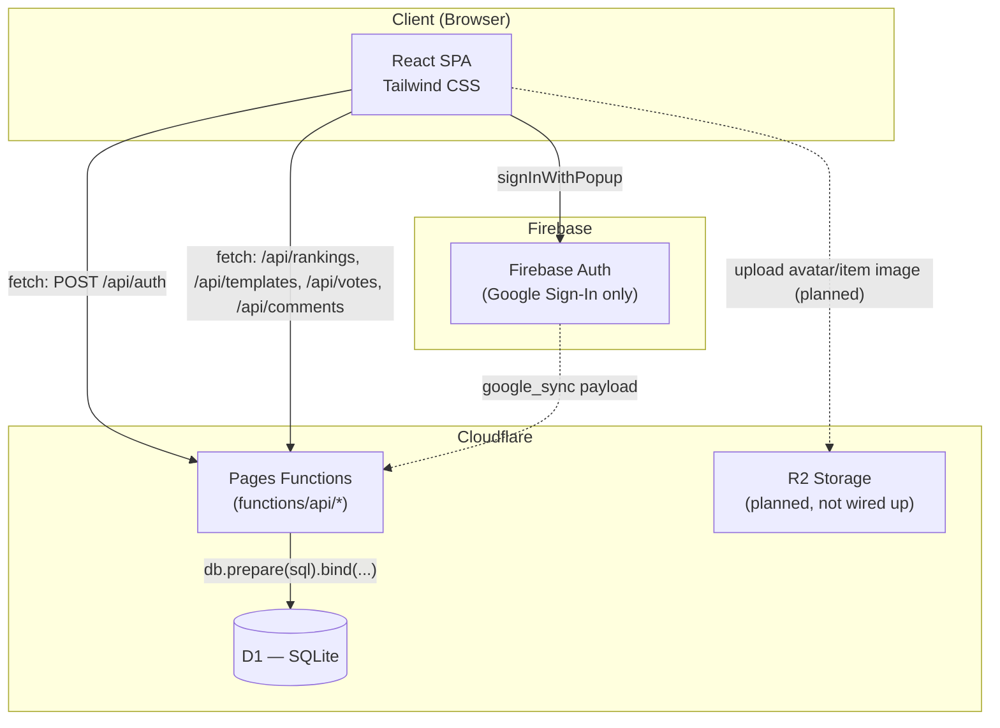
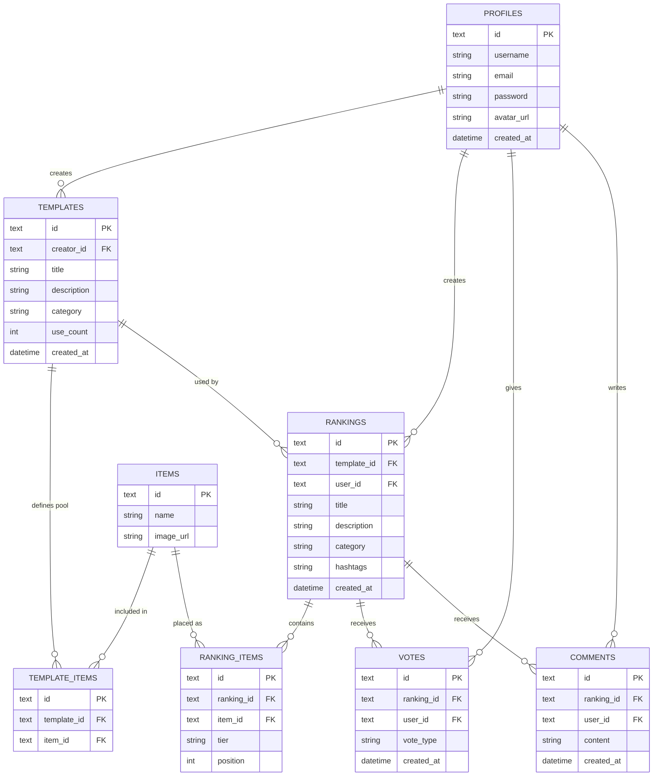
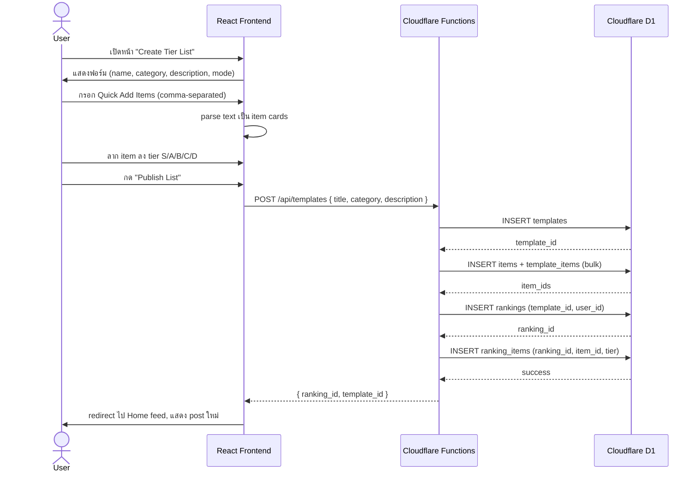
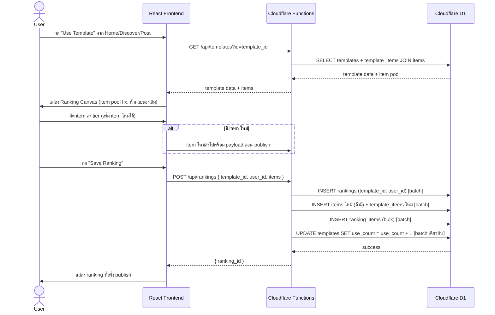

# Software Design Specification: Tear of God

**Social Platform for Creating and Ranking Tier Lists**
(แพลตฟอร์มโซเชียลสำหรับการสร้างและจัดอันดับเทียร์ลิสต์)

| | |
|---|---|
| **Advisor** | ดร. ณัฐพล หาญสมุทร |
| **Team** | 67025044 รินรพัชร แสนคำ · 67022928 สมพล หยดย้อย · 67023019 อภิทรัพย์ ภาระหันต์ |
| **Version** | 1.0 |
| **Date** | 16 July 2026 |
| **Status** | Draft — ต้องให้ทีมรีวิว [Section 9](#9-design-decisions--open-assumptions) ก่อน finalize |

> เอกสารฉบับนี้จัดทำต่อยอดจาก Project Proposal ของทีม โดยมี Claude (Anthropic) ช่วยร่างตามคำสั่งงานที่ให้ใช้ AI ช่วยเขียน SDS

---

## 1. Introduction

### 1.1 Purpose
เอกสารนี้อธิบาย **การออกแบบ** ของระบบ Tear of God ในระดับที่ทำให้ผู้อ่าน (ผู้สอน, เพื่อนร่วมทีม, หรือ dev ที่เข้ามาใหม่) เข้าใจสถาปัตยกรรม โครงสร้างข้อมูล และ flow การทำงานหลัก โดยไม่ต้องไล่อ่านโค้ด ต่างจาก Project Proposal ที่เน้นตอบคำถามว่า "ทำไมถึงทำ" และ "ระบบทำอะไรได้บ้าง" เอกสารนี้เน้นตอบคำถามว่า **"ระบบถูกออกแบบมาให้ทำงานแบบนั้นได้อย่างไร"**

### 1.2 Scope
ระบบเป็นเว็บแอปพลิเคชันโซเชียลขนาดเล็กที่มี core feature คือการสร้าง Tier List (จัดอันดับ S/A/B/C/D หรือ Top 10), การ remix Tier List ของผู้อื่น, การมีปฏิสัมพันธ์ (like/comment/share) และการรวบรวมผลโหวตมาแสดงเป็นสถิติ/เทรนด์ ครอบคลุมทั้งฝั่ง User ทั่วไปและฝั่ง Admin

### 1.3 Definitions
| คำศัพท์ | ความหมาย |
|---|---|
| **Template** | ชุด item pool + metadata (ชื่อ, หมวดหมู่, คำอธิบาย, mode) ที่ผู้สร้างคนแรกกำหนดไว้ ใช้เป็นต้นแบบให้คนอื่น remix ได้ |
| **Ranking** (Tier List) | การจัดอันดับ item ของ Template หนึ่ง ๆ โดยผู้ใช้คนใดคนหนึ่ง (อาจเป็นผู้สร้าง Template เองหรือคน remix) |
| **Remix** | การที่ผู้ใช้หยิบ Template ของคนอื่นมาสร้าง Ranking ในแบบของตัวเอง |
| **Tier Label** | ชื่อระดับการจัดอันดับ (S, A, B, C, D) ตายตัว 5 ระดับ แก้ไขไม่ได้หลังสร้าง Template |
| **Top 10 Mode** | โหมดจัดอันดับแบบตำแหน่ง 1–10 แทนที่จะเป็น tier label |

### 1.4 References
- Project Proposal — `proposal.pdf` (เอกสารต้นฉบับที่แนบมา)
- UI/UX Mockup — Google Stitch: `https://stitch.withgoogle.com/projects/2992567517623773020` (ต้องล็อกอินเพื่อดู ไม่สามารถดึงเนื้อหามาอ้างอิงในเอกสารนี้ได้โดยตรง — อ้างอิง wireframe จาก proposal.pdf หน้า 8–16 แทน)

---

## 2. System Overview

### 2.1 Product Perspective
Tear of God เป็นระบบแบบ **feed-based social app** (คล้าย pattern ของ short-form content feed ทั่วไป) แต่หน่วยเนื้อหาคือ "Tier List" แทนที่จะเป็นวิดีโอ/รูปภาพ จุดต่างจากเว็บจัดอันดับทั่วไปคือมี layer สถิติ/เทรนด์ที่รวบรวมจากพฤติกรรมโหวตของผู้ใช้ทั้งหมด

### 2.2 User Classes
| Actor | คำอธิบาย |
|---|---|
| **Guest** | ผู้ใช้ที่ยังไม่ล็อกอิน ดูฟีดหลักและเทรนด์ได้ แต่สร้าง/โหวต/คอมเมนต์ไม่ได้ |
| **User** | สมาชิกที่ล็อกอินแล้ว ทำได้ทุกอย่างใน scope 4.1 |
| **Admin** | ผู้ดูแลระบบ เข้าถึงหน้าหลังบ้านเพื่อจัดการเนื้อหาและผู้ใช้ |

### 2.3 Operating Environment
Responsive web application รันบน browser สมัยใหม่ (Chrome/Edge/Safari ล่าสุด) ไม่มีการระบุแอปมือถือแยกใน proposal — ถือว่า responsive design ครอบคลุม mobile web ตาม wireframe ที่ออกแบบใน Google Stitch

---

## 3. Functional Requirements

| ID | Requirement | รายละเอียด | Actor | Proposal Ref |
|---|---|---|---|---|
| FR-1 | Register | สมัครบัญชีด้วยอีเมล/รหัสผ่าน | Guest | 4.1.1 |
| FR-2 | Login / Forgot Password | ล็อกอิน และรีเซ็ตรหัสผ่านผ่านอีเมลกรณีลืม | Guest, User | 4.1.1 |
| FR-3 | Edit Profile | เปลี่ยนชื่อผู้ใช้และรูปโปรไฟล์ | User | 4.1.2 |
| FR-4 | View My Templates & Rankings | ดูรายการ Template ที่สร้าง และ Ranking ที่เคยเข้าร่วม | User | 4.1.2 |
| FR-5 | Browse Home Feed | เลื่อนดูฟีดแบบ Infinite Scroll พร้อม Trending Topics | Guest, User | 4.1.3 |
| FR-6 | Create Tier List (Normal Mode) | ตั้งชื่อ/หมวดหมู่/คำอธิบาย, เพิ่ม item ผ่าน Quick Add (text-to-item) แล้วจัดลง 5 tier (S/A/B/C/D) | User | 4.1.4 |
| FR-7 | Create Tier List (Top 10 Mode) | สุ่มนำเสนอ item ทีละตัวให้จัดลงตำแหน่ง 1–10 ห้ามซ้ำตำแหน่ง | User | 4.1.4 |
| FR-8 | Remix Template | นำ Template ผู้อื่นมาจัด Ranking ใหม่, เพิ่ม item ใหม่ได้, **แก้ tier label ไม่ได้** | User | 4.1.5 |
| FR-9 | View Statistics | ดูสถิติภาพรวมของ Template และของ Ranking ย่อย พร้อมจำนวนผู้ใช้ที่ใช้ Template นั้น | User | 4.1.6 |
| FR-10 | Like / Comment / Share | กดถูกใจ, คอมเมนต์, และคัดลอกลิงก์แชร์ Ranking | User | 4.1.7 |
| FR-11 | Admin Login | ล็อกอินเข้าระบบหลังบ้านแยกจากผู้ใช้ทั่วไป | Admin | 4.2.1 |
| FR-12 | Content Moderation | ตรวจสอบข้อมูลภาพรวม, ลบ/แก้ไข Ranking และลบคอมเมนต์ที่ผิดกฎ | Admin | 4.2.2 |
| FR-13 | Ban User | ระงับบัญชีผู้ใช้งาน | Admin | 4.2.2 |
| FR-14 | Personalized Feed | ปรับลำดับเนื้อหาในฟีดตามหมวดหมู่ที่ผู้ใช้กดถูกใจบ่อย | User | 4.3.1 |

---

## 4. Non-Functional Requirements

| ID | Category | Requirement |
|---|---|---|
| NFR-1 | Performance | Home Feed ใช้ cursor-based pagination (ไม่ใช้ large `OFFSET`) เพื่อรองรับ Infinite Scroll โดยไม่หน่วง |
| NFR-2 | Security | D1 (SQLite) ไม่มี Row Level Security ในตัวแบบ Postgres — enforce สิทธิ์ที่ชั้น API แทน: แต่ละ `functions/api/*` handler เช็คว่า `user_id` ที่แก้ไข/ลบตรงกับเจ้าของ record ก่อนอนุญาต, เฉพาะ `role = admin` เท่านั้นที่ข้ามเงื่อนไขนี้ได้ (ดู open issue เรื่อง session/token ใน NFR-6) |
| NFR-3 | Data Integrity | Tier label ต้องถูกจำกัดที่ 5 ค่าคงที่ผ่าน `CHECK` constraint ที่ระดับ D1/SQLite (ไม่มี native `enum` type ใน SQLite) ไม่ใช่แค่ validate ฝั่ง frontend |
| NFR-4 | Usability | Responsive layout ให้ตรงกับ wireframe ที่ออกแบบใน Google Stitch ทั้ง desktop และ mobile web |
| NFR-5 | Scalability | Query สำหรับ trending/personalized feed ออกแบบให้ปรับเป็น materialized view ได้ภายหลังหากจำนวนผู้ใช้เพิ่มขึ้นมาก |
| NFR-6 | Reliability | Session handling: `functions/api/auth.js` ควรออก signed token (เช่น HMAC ผ่าน Web Crypto `crypto.subtle`, ใช้ `jsonwebtoken` ไม่ได้เพราะเป็น Node-only package) ให้ client เก็บและแนบมาทุก request แทนการส่ง `user_id` ตรงๆ ใน body — **ยังไม่ implement ในโค้ดปัจจุบัน (gap ด้าน security ที่ต้องแก้ก่อน production)** |

---

## 5. System Architecture

### 5.1 Architecture Diagram

ระบบมี custom backend server แยกจริง — เขียนเป็น Cloudflare Pages Functions (Workers runtime, ไม่ใช่ Node.js) แทนที่จะเป็น BaaS ตรงๆ ตามแผนตั้งต้น (ดู Section 9 ข้อ 1) React เรียก REST endpoint ของตัวเองผ่าน `fetch`, ไม่มี library SDK คั่นกลางแบบ `supabase-js` ความปลอดภัยของข้อมูลต้องอยู่ที่ชั้น API (`functions/api/*` เช็คสิทธิ์เอง) เพราะ D1 ไม่มี RLS ให้ใช้เหมือน Postgres ของ Supabase

### 5.2 Component Breakdown

| Module | หน้าที่ | Screens ที่เกี่ยวข้อง |
|---|---|---|
| `auth/` | สมัคร/ล็อกอิน (email+password ผ่าน `functions/api/auth.js`) / Google Sign-In ผ่าน Firebase | Login |
| `feed/` | Home Feed, category tabs, infinite scroll, personalization | Home (For You/Trending/Anime/Movie/Food/Sport) |
| `create/` | ฟอร์มสร้าง Template + Ranking Canvas (Normal/Top 10) | Create Tier List |
| `discover/` | เรียกดู Template ตามหมวดหมู่, popular templates | Discover |
| `ranking-detail/` | หน้ารายละเอียด Ranking, Community Rankings, Rank this Template | Template/Ranking detail |
| `profile/` | ดู/แก้ไขโปรไฟล์, Templates Created, Participated Tier Lists | Profile, Edit Profile modal |
| `admin/` | Protected route จัดการเนื้อหา/ผู้ใช้ | (ไม่มี wireframe แนบ — ดู Section 9) |

### 5.3 Technology Stack

| Layer | เทคโนโลยี |
|---|---|
| Frontend | React 19 + Vite, React Router v7 |
| UI Framework | Tailwind CSS 4 |
| Backend | Cloudflare Pages Functions (`functions/api/`), Workers runtime |
| Database | Cloudflare D1 (SQLite) |
| Storage | Cloudflare R2 (planned, not wired up yet) |
| Auth | Custom email/password (D1) + Google Sign-In via Firebase Auth |
| UX/UI Design | Google Stitch |

---

## 6. Data Design

### 6.1 Entity-Relationship Diagram

### 6.2 Table Descriptions
- **profiles** — ตารางผู้ใช้หลักของระบบเอง (ไม่ได้ต่อยอดจาก Supabase `auth.users` อีกต่อไป) เก็บ `password` เอง (ต้อง hash ก่อนเก็บ — ดู open issue ด้านความปลอดภัยใน NFR-2/6) ยังไม่มีคอลัมน์ `role` สำหรับแยก admin ตาม FR-11–13 ต้องเพิ่มทีหลัง
- **templates** — item pool ต้นแบบ, `use_count` นับจำนวน ranking ที่ผูกกับ template นี้ (สำหรับ FR-9); ยังไม่มีคอลัมน์ `mode` (`normal`/`top10`) ในตารางจริง ต้องเพิ่มถ้าจะรองรับ FR-7
- **template_items** — bridge table ระหว่าง `templates` กับ `items` กลาง แทนที่จะ denormalize ชื่อ/รูปซ้ำในตัวเอง (ต่างจากดราฟต์แรกที่มี `template_items.label`/`image_url` ของตัวเอง) เพื่อให้ item ตัวเดียวกันใช้ซ้ำข้ามหลาย template ได้โดยไม่ต้อง insert ซ้ำใน `items`
- **items** — item กลางของทั้งระบบ ทั้ง `template_items` และ `ranking_items` อ้างอิงมาที่นี่
- **rankings** — การจัดอันดับหนึ่งครั้งของ user หนึ่งคน อาจผูกกับ `template_id` (กด Use Template มาจัด) หรือ `template_id = NULL` (สร้างอิสระโดยไม่มี template — ยังไม่มี UI แยกสองเคสนี้ชัดเจน ต้อง confirm กับทีมว่ายังต้องการโพสต์อิสระแบบไม่มี template อยู่ไหม)
- **ranking_items** — mapping ว่า item แต่ละตัวถูกจัดไว้ที่ tier ไหน (`tier` = S/A/B/C/D) หรือตำแหน่งไหน (`position` = 1–10 สำหรับ Top 10 Mode)
- **votes / comments** — ผูกกับ `rankings` (ไม่ใช่ `templates`) เพราะ engagement เกิดที่ post ในฟีดซึ่งคือ ranking หนึ่ง ๆ ตาม wireframe; `votes.vote_type` บังคับเป็น `like`/`dislike` ผ่าน `CHECK` constraint แทนตาราง `likes` แยก

### 6.3 Business Rule Constraints
- **Fixed tier labels**: `ranking_items.tier` ต้องอยู่ในชุดค่าคงที่ (`S`,`A`,`B`,`C`,`D`) — บังคับด้วย `CHECK` constraint ที่ D1, ไม่ปล่อยให้ frontend เป็นเกราะป้องกันเดียว (NFR-3); ตาราง `ranking_items` ปัจจุบันยังไม่มี constraint นี้จริง ต้องเพิ่มใน `schema.sql`
- **Top 10 uniqueness**: เมื่อ ranking มาจาก template ที่โหมด Top 10, `ranking_items.position` ต้อง unique ภายใน `ranking_id` เดียวกัน (1–10 ห้ามซ้ำ) — แนะนำใช้ unique constraint บนคู่ `(ranking_id, position)`
- **Remix ห้ามแก้ item pool ที่มีอยู่**: item ใน `template_items` ของ template หนึ่งแก้ไม่ได้หลังสร้าง เพิ่มได้เฉพาะ item ใหม่ (ดู Section 9 ข้อ 2) — enforce ที่ frontend และควร enforce ซ้ำที่ชั้น API เพราะ D1 ไม่มี RLS/trigger ระดับ policy ให้ใช้เหมือน Supabase, ต้องเช็คเองใน `functions/api/*`
- **use_count ต้องอัปเดตแบบ atomic**: ตอนสร้าง ranking ใหม่จาก template ต้อง `UPDATE templates SET use_count = use_count + 1` ในทรานแซกชันเดียวกับการ insert ranking (ใช้ `db.batch()` ของ D1) ไม่งั้นตัวเลขจะเพี้ยนถ้า request ล้มเหลวครึ่งทาง

---

## 7. Interface Design

### 7.1 Screen Inventory
อ้างอิงจาก wireframe ใน `proposal.pdf` (หน้า 8–16):

| Screen | Purpose | Key Elements |
|---|---|---|
| Login | เข้าสู่ระบบ/สมัครสมาชิก | Email/Password field, "Continue with Google", link ไปหน้าสมัคร |
| Home Feed | ฟีดหลัก แยกตาม tab (For You / Trending / Movies / Anime / Food / Sports) | Card ต่อ 1 ranking: avatar, username, category tag, tier rows (สี S=แดง, A=ส้ม, B=เหลือง, C=เขียว, D=ฟ้า), like/comment count, ปุ่ม "Use Template" |
| Create Tier List — Normal Mode | สร้าง Template + Ranking แบบ 5 tier | ฟอร์ม (Template Name, Category, Description), Quick Add Items (textarea + Generate Cards), Ranking Canvas 5 แถวสี, Unranked Items Pool |
| Create Tier List — Top 10 Mode | สร้าง Ranking แบบตำแหน่ง 1–10 | สลับโหมดด้วย toggle, ต้องมี item ครบ 10 ชิ้นพอดี, ช่องตำแหน่ง 1–10 |
| Ranking Detail | ดู/แก้ไข ranking หนึ่งรายการ | ชื่อ ranking (แก้ได้), Save Ranking, Share, ปุ่ม Shuffle Items / Sort A-Z |
| Discover | ค้นหา Template ตามหมวดหมู่ | Category grid (Anime/Movie/Food/Sport), Popular Templates cards พร้อมจำนวนผู้ใช้ |
| Community Rankings (จาก Discover) | ดูภาพรวมผลโหวตของชุมชนต่อ Template | Sort dropdown (เช่น Most Liked), toggle "Community Average" |
| Profile | ดูผลงานของตัวเอง | Tab "Templates Created" / "Participated Tier Lists", ปุ่ม Edit Profile |
| Edit Profile (modal) | แก้ไขข้อมูลส่วนตัว | Username, Bio, Save Changes |

### 7.2 Key UI Components
- **Ranking Canvas** — reusable component ใช้ทั้งตอนสร้างและตอน remix, รับ prop เป็น tier labels (fixed 5 แบบ หรือ 1–10) และ item list
- **Tier Color Convention** — S = แดง, A = ส้ม, B = เหลือง, C = เขียว, D = ฟ้า (ใช้สม่ำเสมอทุกหน้าที่แสดง tier)
- **Quick Add Items** — text parser ที่รับ comma-separated string แล้ว generate เป็น item card อัตโนมัติ (ตรงกับ FR-6)

---

## 8. Use Cases & Key Flows

### 8.1 Actor / Use Case Summary
ดู Use Case Diagram ต้นฉบับใน `proposal.pdf` หน้า 6–7 ประกอบ

| Actor | Use Cases |
|---|---|
| Guest | View Home Feed & Trends, Register |
| User | ทุกอย่างที่ Guest ทำได้ + Login, Manage Profile, Create Tier List (Normal/Top 10), Remix, Like/Comment/Share, View Statistics |
| Admin | Login to Backend, Review Overview Data, Edit/Delete Inappropriate Ranking, Delete Rule-breaking Comments, Ban User |

### 8.2 Sequence Diagram: Create Tier List (Normal Mode)

### 8.3 Sequence Diagram: Remix Template ("Use Template")

---

## 9. Design Decisions & Open Assumptions

Proposal ไม่ได้ลงรายละเอียดระดับ implementation ไว้ทั้งหมด ส่วนนี้สรุปจุดที่เอกสารนี้ "ตัดสินใจแทน" และควรให้ทีมยืนยันก่อนเริ่ม implement จริง:

1. **[เดิม] BaaS ไม่มี custom backend** — decision นี้ล้าสมัยแล้ว ทีมเปลี่ยนมาเขียน custom backend เองเป็น Cloudflare Pages Functions (`functions/api/`) บน D1 แทน BaaS ตรงๆ ตาม Supabase; เหตุผลไม่ได้บันทึกไว้ในเอกสาร แต่ผลคือได้ควบคุม business logic เต็มที่และไม่ผูกกับ RLS policy ของผู้ให้บริการรายเดียว
2. **Remix เพิ่ม item เข้า shared pool** — item ใหม่ที่เพิ่มระหว่าง remix ถูก insert เข้า `items` (item กลาง) แล้วผูกเพิ่มใน `template_items` ของ template เดิม (ไม่ใช่แยกเฉพาะ ranking ของคนนั้น) เพื่อให้คน remix คนถัดไปเห็น item ครบและสถิติสะสมถูกต้อง — ของเดิมใน `items` ไม่ถูกแก้ ลบ หรือย้ายออกจาก template เดิม แก้ได้แค่ "เพิ่ม"
3. **Personalized feed แบบ query-time** — เริ่มจาก aggregate query (`COUNT` votes group by category ของ user ใน N วันล่าสุด) แทนการสร้างตารางสะสมคะแนนแยก เพื่อความง่ายในสโคปนักศึกษา ค่อย migrate เป็น materialized view ถ้าข้อมูลโตขึ้นจริง (NFR-5)
4. **Admin เป็น protected route ใน SPA เดียวกัน** ไม่ใช่แอปแยก — ลด overhead การดูแลสองโปรเจกต์ ใช้ role-based guard ผ่าน `profiles.role` (คอลัมน์นี้ยังไม่มีจริงใน `schema.sql` ปัจจุบัน ต้องเพิ่ม)
5. **Top 10 randomization** — ตีความ "สุ่มคำตอบมาทีละอัน" (4.3.2) เป็นกลไก client-side สุ่มลำดับ item จาก unranked pool มาให้ทีละตัว บังคับผู้ใช้เลือกตำแหน่งก่อนเห็นตัวถัดไป — ควร confirm กับทีมว่าตรงกับที่ตั้งใจไว้ เพราะ wireframe หน้า 12 แสดงแค่ layout ตำแหน่ง 1–10 ไม่ได้แสดงกลไกการสุ่มโดยตรง
6. **Frontend สร้าง UI ของ Templates ไว้ล่วงหน้าบน mock data** — `TemplateDetailPage.jsx` และ `AboutTemplateCard.jsx` (sidebar ปุ่ม Use Template / View Community Average) มีหน้าตาสมบูรณ์แล้วตรงตาม wireframe แต่ต่อกับ `src/data/mockTemplates.js` เท่านั้น ยังไม่เคยเรียก API จริง สถานะปัจจุบัน:
   - `schema.sql` ยังไม่มีตาราง `templates` / `template_items` — **ต้องเพิ่มก่อน** (ดู Section 6.1 ที่อัปเดตแล้ว)
   - ยังไม่มี `functions/api/templates.js` — ต้องสร้างใหม่ รองรับอย่างน้อย `GET /api/templates?id=` (ดึง template + item pool + รายการ ranking ทั้งหมดที่ผูกกับ template นั้นสำหรับหน้า Community Rankings) และ `POST /api/templates` (สร้าง template ใหม่ตอน publish ครั้งแรก)
   - ปุ่ม "Use Template" ใน `AboutTemplateCard.jsx` ยังไม่มี `onClick` และ `PostDetail.jsx` ไม่เคยส่ง prop `templateId` เข้าไปเลย ทำให้ปุ่ม "View Community Average" ปิดใช้งานถาวรในหน้าที่ใช้งานจริง (ไม่ใช่ปัญหาที่ `TemplateDetailPage.jsx` เอง)
   - "Community Average" (ค่าเฉลี่ยของ community) ยังไม่มี logic คำนวณจริง ต้องเขียน aggregate query ต่อ item ต่อ template (เช่น tier ที่ถูกเลือกบ่อยที่สุด/mode ของ tier ในทุก ranking ที่ผูก template เดียวกัน) — เป็นจุดที่ตรงกับ "consensus ranking" ที่เป็น key differentiator ของโปรเจคนี้อยู่แล้ว

---

## Appendix A: Project Timeline

| Month | Week | Milestone |
|---|---|---|
| June | 1 | ปรึกษาอาจารย์ที่ปรึกษาเรื่องหัวข้อ |
| June | 2–3 | ศึกษาหาข้อมูล |
| June | 4 | คุยกับอาจารย์เรื่องฟีเจอร์ที่จะทำ |
| July | 1 | ออกแบบ UX/UI และฐานข้อมูล |
| July | 2–3 | เริ่มพัฒนา Frontend |
| July | 4 | ปรับปรุง UI และทดสอบเบื้องต้น |
| August | 1 | เริ่มพัฒนา Backend |
| August | 2 | พัฒนาระบบจัดการข้อมูล |
| August | 3 | Backend สมบูรณ์ |
| August | 4 | เริ่มทำรูปเล่มโครงการ |
| September | 1–2 | ปรับปรุงตามข้อเสนอแนะ |
| September | 3 | ทดสอบระบบโดยรวม |
| September | 4 | จัดทำรายงานฉบับสมบูรณ์ |

## Appendix B: References
- Project Proposal: `proposal.pdf`
- UI/UX Mockup (Google Stitch): `https://stitch.withgoogle.com/projects/2992567517623773020`
