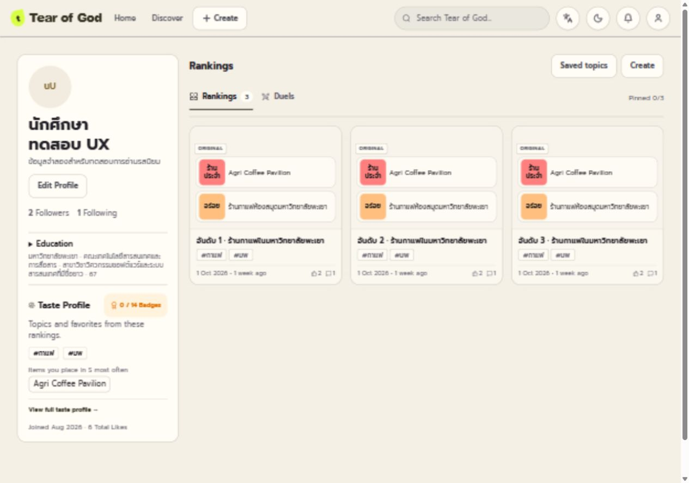
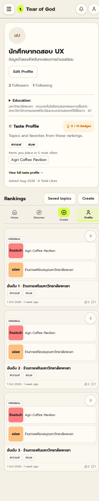

# Final Hybrid P1 UX report

วันที่ตรวจ: 8 ตุลาคม 2026 · ฐาน `origin/main` commit `87b534f` · branch `codex/final-hybrid-p1-ux`

Implementation อ้างอิงรายงาน `docs/production-vs-experimental-design-audit.md` ที่อ่านก่อนแก้ source ใช้ NEW เป็นฐานและแก้เฉพาะ Profile, Auth state/copy และ Discover quiet state ภาพ “before” และการตรวจข้อมูลจริงเก็บไว้ในเครื่องจาก audit เดิม ส่วนภาพที่เผยแพร่ใน PR ใช้ fixture เท่านั้น ไม่ได้สร้างข้อมูล production

## 1. Profile desktop ก่อน/หลัง

ก่อน: Identity → Rankings → Taste → Education อยู่ในแนวตั้งเดียวกัน ความยาว rankings จึงกำหนดระยะทางไปถึง identity context ส่วนอื่น

หลัง: ตั้งแต่ 1024px ใช้ grid `300px minmax(0,1fr)` ด้านซ้ายเรียง Avatar → Username/badge → Bio → Follow/Edit → Followers/Following → Education → Taste → Joined/Likes ด้านขวาเป็น Rankings ตามปกติ ที่ 1024px ใช้การ์ดสองคอลัมน์ และตั้งแต่ 1280px สามคอลัมน์ ไม่มี nested scrolling



## 2. Education placement และ sticky

Education อยู่ใต้ follower controls และก่อน Taste/Rankings ทั้ง desktop, tablet และ mobile ใช้ disclosure พร้อมสรุปค่าที่มีจริง กดขยายเห็น University, Faculty, Major, Admission Year เต็ม ไม่มีการเดาตัวย่อหรือซ่อนค่าต้นฉบับ ถ้าไม่มีข้อมูลไม่สร้าง Education เปล่า

`ResizeObserver` และ viewport resize ประเมิน sidebar ใหม่ Sticky เปิดเฉพาะ desktop และความสูง sidebar ≤ viewport height − 112px ตำแหน่ง sticky 96px ไม่กำหนด max-height หรือ overflow container

ผล browser: sidebar fixture ปกติสูงประมาณ 728px ปิด sticky ที่ 1024×768 และเปิดที่ 1280×900 เมื่อขยาย Education สูง 880px ที่ 1280×900 จะปิด sticky ชื่อไทยยาวทำให้ sidebar สูงประมาณ 1052px และปิด sticky ทุก desktop ที่ตรวจ หลังเลื่อนไปโหลดรายการถัดไป sidebar ที่พอดีจออยู่ top 96px ขณะที่ navbar bottom 69px

[ภาพ Education ขยายบนมือถือ](../artifacts/final-hybrid-p1-ux/profile-education-expanded-390.jpg) · [sidebar ขยายที่ 1280px](../artifacts/final-hybrid-p1-ux/profile-expanded-1280.jpg) · [sticky หลังเลื่อน](../artifacts/final-hybrid-p1-ux/profile-sticky-after-next-1280.jpg)

## 3. Taste placement

Taste เป็นส่วนหนึ่งของ sidebar ก่อน feed แสดง top hashtags สูงสุด 3 รายการและ favorite items สูงสุด 3 รายการ พร้อมทางเข้า full taste modal และ badges เดิม เอา percentage ออกจาก compact summary รายละเอียดใน modal ยังอยู่ ไม่มี progress bar หรือ analytics dashboard เพิ่ม เมื่อไม่มี Taste data ยังคงมีข้อความอธิบายและ entry ไป modal

[Taste modal ที่ 390px](../artifacts/final-hybrid-p1-ux/taste-modal-390.jpg)

## 4. ผล scalability 3 / 20 / 100

ใช้ real production build กับ read-only fixture server `tests/local/final-hybrid-p1-fixture-server.mjs` ซึ่ง mock API ใน memory และปฏิเสธทุก request ที่ไม่ใช่ GET ไม่ต่อ D1 และไม่ persist ข้อมูล

| จำนวน rankings | ครั้งแรก | หลัง Next | Education/Taste entry |
| --- | ---: | ---: | --- |
| 3 | 3 | ไม่ต้องโหลดเพิ่ม | ก่อน feed ทั้ง 9 viewport |
| 20 | 20 | ไม่ต้องโหลดเพิ่ม | ก่อน feed ทั้ง 9 viewport |
| 100 | 50 | 100 | ก่อน feed ทั้ง 9 viewport และหลัง Next ที่ 390/1280px |

DOM order ของ entry ไม่เปลี่ยนตามจำนวนการ์ด บน mobile/tablet วัดขอบล่าง Education/Taste ก่อนขอบบน rankings จริง บน desktop ทั้งสองอยู่ sidebar ที่มาก่อน rankings ใน reading order ไม่ต้องเลื่อนผ่าน feed เพื่อไปค้นท้ายหน้า ตรวจบัญชีที่มีอยู่บน local full stack เพิ่ม: own 3 rankings และ other user 7 rankings โดยอ่านอย่างเดียว

[ข้อมูล geometry 54 สถานะ](../artifacts/final-hybrid-p1-ux/responsive-results.json) · [interaction results](../artifacts/final-hybrid-p1-ux/interaction-results.json) · [fixture 100 rankings](../artifacts/final-hybrid-p1-ux/profile-100-1440.jpg)

## 5. Mobile ranking-card decision

เลือก Option A: หนึ่งคอลัมน์ก่อน 640px จาก browser ที่ 320/360/390/430px กว้างพอให้เข้าใจว่าเจ้าของจัดอะไร การ์ดแสดงชื่อรายการ 14px, hashtag/reaction count และสอง tier cues พร้อมชื่อ item สูงสุดสองชื่อในแต่ละ tier ชื่ออ่านได้ 12px และ wrap ตามพื้นที่ รูปเป็น thumbnail เสริมชื่อ ไม่ย่อ full board เป็นกล่องตัวหนังสือเล็ก และไม่มี fixed height ที่ตัดชื่อ item ทิ้ง ยังคง regular grid และ shared `TierLabel` พร้อมสีจากข้อมูล



## 6. Auth state ก่อน/หลัง

ก่อน: Login/Register ใช้ password และ visibility state ร่วมกันโดยไม่ reset เมื่อเปลี่ยน mode จึงเห็น credentials ของ mode เดิม

หลัง: ทั้ง mobile switch และ desktop visual panel ใช้ `changeMode()` เดียวกัน เก็บ email; ล้าง password, confirmPassword, showPassword, showConfirmPassword และ mode error เปลี่ยน validation/errors ของหน้านี้เป็น inline alert ที่อยู่ใน active form และล้างตอนเปลี่ยน mode Username คงเป็น state แยก เก็บค่าที่ผู้ใช้พิมพ์ได้และไม่สร้างจาก email ระหว่าง request pending ไม่เปลี่ยน mode

Browser กรอกเฉพาะ `ux-test@example.invalid`, dummy password และ `Independent username` สลับสอง round trips ต่อ viewport รวม 36 transitions ทั้ง 9 ขนาด: password/confirm ว่างและ masked ทุกครั้ง ตรวจ email retained และ username ด้วย screenshot เพราะ browser DOM redacts credential values ไม่กด Log In, Sign Up หรือ Google ระหว่าง acceptance test การล้าง old validation/error ตรวจด้วย regression ที่เรียก handler จริงใน VM ไม่ส่งฟอร์ม

[หลัง: Register 1280px](../artifacts/final-hybrid-p1-ux/auth-register-1280.jpg) · [หลัง: Register 390px](../artifacts/final-hybrid-p1-ux/auth-register-390.jpg) · [36 transitions](../artifacts/final-hybrid-p1-ux/auth-results.json)

## 7. Guest/auth copy

Login EN: “Log in to publish your rankings, keep them in your account, and join conversations.”

Login TH: “เข้าสู่ระบบเพื่อเผยแพร่อันดับ เก็บไว้ในบัญชี และร่วมพูดคุยกับชุมชน”

ตรวจ Home/Create entry `Start without signing up` และ Rank guest hint ที่บอกว่า draft อยู่บนอุปกรณ์และ login ตอน publish ซึ่งสอดคล้องกันอยู่แล้ว แก้ shared guest prompt EN/TH ที่เดิมยังระบุว่า login ก่อน rank ให้ยืนยันว่าเริ่มจัดอันดับได้โดยไม่มีบัญชี และ login เพื่อ publish/account saving/vote/conversations ไม่เปลี่ยน guest flow

[Login EN desktop](../artifacts/final-hybrid-p1-ux/login-en-1280.jpg) · [Login TH mobile](../artifacts/final-hybrid-p1-ux/login-th-390.jpg)

## 8. Discover quiet fallback

หลัง quiet message โหลด `/api/templates?sort=popular&limit=6&page=1` ผ่าน `fetchTemplates` เดิม แสดง `TemplateCard` เดิมที่เป็น unranked topic preview ใช้ชื่อ “Popular topics to try” / “หัวข้อยอดนิยมที่น่าลองจัด” ไม่อ้าง personalization หรือ activity ของช่วงเวลาจาก popularity

Quiet message ลดเป็นข้อความสั้น ไม่มี empty panel ใหญ่หรือ All topics ซ้ำด้านบน Pulse Explore everything ยังมี All topics หนึ่งจุด เมื่อ fallback fetch ล้มเหลวไม่แสดง stale cards และยังไป All topics ได้ เมื่อ Pulse populated ไม่โหลด/แสดง fallback response ที่กลับมาหลังเปลี่ยน state ถูกยกเลิกด้วย cleanup guard

Browser ตรวจ 27 สถานะ (quiet 6 cards / populated / fallback HTTP 503 × 9 viewport) ไม่พบ overflow และทุกสถานะมี All topics link หนึ่งจุด ตรวจ local full stack เพิ่มและเห็น 6 หัวข้อจริงที่มาจากข้อมูลเดิม เช่นร้านกาแฟในมหาวิทยาลัยพะเยา ไม่มีการเขียนข้อมูลใหม่

[หลัง quiet fixture](../artifacts/final-hybrid-p1-ux/discover-quiet-1440.jpg) · [populated fixture](../artifacts/final-hybrid-p1-ux/discover-populated-1440.jpg) · [fallback failure](../artifacts/final-hybrid-p1-ux/discover-fallback-failed-390.jpg)

## 9. Responsive QA

| Viewport | Profile 6 scenarios | Auth repeated switch | Discover 3 states |
| --- | --- | --- | --- |
| 320×568 | Pass | Pass | Pass |
| 360×740 | Pass | Pass | Pass |
| 390×844 | Pass | Pass | Pass |
| 430×932 | Pass | Pass | Pass |
| 768×1024 | Pass | Pass | Pass |
| 820×1180 | Pass | Pass | Pass |
| 1024×768 | Pass | Pass | Pass |
| 1280×900 | Pass | Pass | Pass |
| 1440×900 | Pass | Pass | Pass |

Profile 6 scenarios: own 3, other 20, other 100, empty 0, long Thai username/education 20, no education/no Taste 3 รวม 54 records นอกจากนี้ตรวจ long Thai fixture ใน UI ภาษาไทยอีกทั้ง 9 viewport ไม่พบ overflow และ mobile entry อยู่ก่อน feed ขนาด sidebar ยาวปิด sticky ทั้งหมด

หลักฐานเป็น actual browser geometry และ screenshot ของ real build ไม่ใช่การคำนวณความกว้างจาก source อย่างเดียว หน้า mobile มี bottom navigation เดิมและ tablet ยังใช้ navigation เดิม ไม่แก้ global layout

[Thai long identity results](../artifacts/final-hybrid-p1-ux/thai-profile-results.json) · [Discover results](../artifacts/final-hybrid-p1-ux/discover-results.json)

## 10. Tests

`npm run build` ผ่าน `npm run lint` ผ่าน (exit 0; 4 warnings Fast Refresh เดิมใน Toast/UserContext/ThemeContext/BookmarkContext)

รันชุดที่ผู้ใช้กำหนดครบและผ่าน:

```text
editor-detail-regression            auth-regression
community-item-identity             community-social-loop
discover-pulse                      template-card-preview-shapes
template-card-preview-comprehensive page-meta-regression
profile-pagination-regression       profile-card-hashtags
profile-links-audit                 primary-navigation-regression
profile-pinned-presentation
```

เพิ่มและรันผ่าน:

- `node tests/local/auth-mode-reset-regression.mjs`: actual central handler ทั้งสองทิศทาง/หลายรอบ, visibility/error reset, independent fields, pending request guard และ EN/TH copy
- `node tests/local/profile-placement-scalability-regression.mjs`: identity placement, mobile grid, sticky fit, 3/20/100 fixtures และ recorded browser geometry 54 สถานะ
- `node tests/local/discover-quiet-fallback-regression.mjs`: popular query, suppression เมื่อมี activity, failure และ late response cleanup

Workers regressions ใช้ isolated local Miniflare D1 ไม่ส่งอีเมล ทดสอบครั้งแรกติด sandbox loopback EACCES แล้วรันนอก sandbox ผ่าน ไม่มี tests/typecheck script ใหม่

## 11. Screenshots และการทำซ้ำ

หลักฐานที่เผยแพร่อยู่ `artifacts/final-hybrid-p1-ux/` รูป fixture แสดงข้อมูลที่จำลองขึ้นเท่านั้น ภาพ before จาก audit NEW เดิม และภาพ `profile-real-*` / `discover-real-*` เก็บเฉพาะในเครื่องเพื่อไม่เผยแพร่ข้อมูลบัญชีจริงบน GitHub ไม่มีรูป fixture ใดถูกอ้างเป็น production data

ภาพ before ที่เก็บในเครื่อง: `before-profile-1280.jpg`, `before-profile-390.jpg`, `before-auth-carryover-1280.jpg`, `before-discover-1280.jpg` ในโฟลเดอร์ artifact เดียวกัน ข้อเปรียบเทียบก่อน/หลังในรายงานยังอ้างอิงผล audit จริง

ทำซ้ำ fixture QA:

```text
npm run build
node tests/local/final-hybrid-p1-fixture-server.mjs
# Browser: http://localhost:8790/profile
# /profile/fixture20 /profile/fixture100 /profile/fixture0
# /profile/long20 /profile/bare3
# /login: switch only, do not submit
# /discover: Now = quiet; This week = populated; Last week = fallback failure
```

แถว JSON ที่ `auth-results.json` ระบุ `emailDOMRedacted` เพื่อไม่อ้างว่าตรวจ credential value ผ่าน DOM ได้ Email/username ตรวจทางภาพ ส่วน password empty/masked ตรวจได้จาก DOM หลัง reset

## 12. สิ่งที่เก็บไว้และ P2 ที่ยังไม่ทำ

เก็บ NEW terminology Topic/Ranking/Community, Rank mine/See community, Guest Rank, tablet/mobile navigation, unranked topic previews, Post readability, Community aggregate semantics, regular grid, data-driven TierLabel และ neutral secondary controls

รอบนี้ยังไม่ทำ Home charcoal hero, tactile primary button system, Quick Add accent, Rank pool redesign, Community difference compaction หรือ global dark outline/offset restoration ไม่แก้ backend/schema/migration/algorithm ไม่มี production DB write, merge หรือ deploy ส่งผ่าน PR เพื่อ review ก่อน
