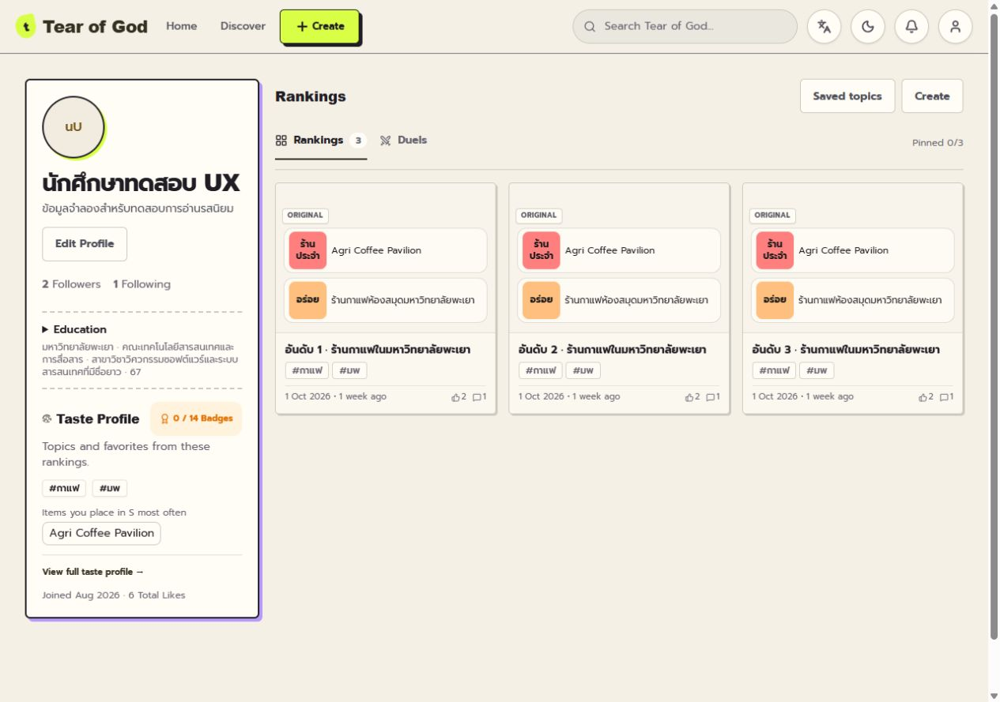
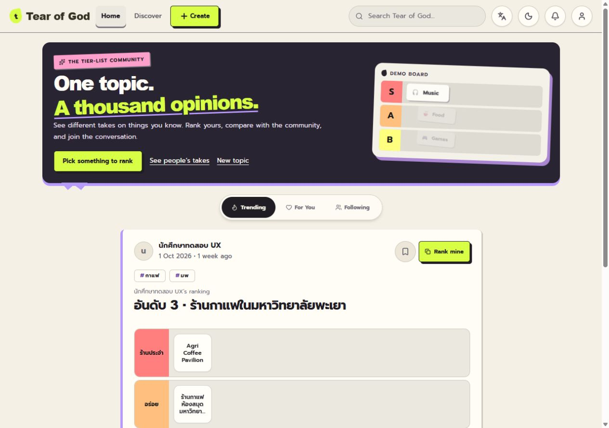
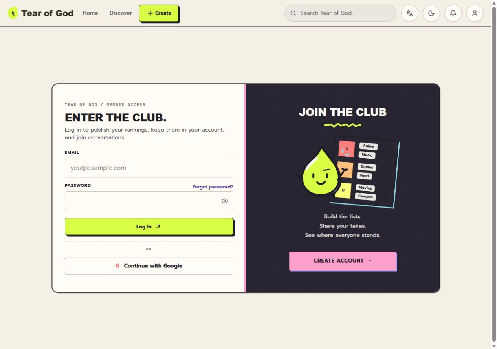

# Production visual restoration report

ตรวจวันที่ 8 ตุลาคม 2026 · ฐาน `origin/main` = `87b534f` · branch `codex/restore-production-visual-with-ux-fixes`

ใช้ visual จาก commit `7975cd0d6e2036502f5e0ece4db8259c0451f5db` เป็นจุดเริ่มต้น แล้วเทียบ browser ของ [Production](https://tear-of-god.pages.dev/) จริงทุกหน้า ไม่ถือว่า source snapshot ตรง deployment ทุกจุด เลือกนำ functional fixes และ regression tests จาก PR #146 (`579a0fb`) มาใช้ โดยไม่ได้ merge PR นั้น

## 1. Visual ที่คืนจาก Production

| หน้า | สิ่งที่คืน | ขอบเขตที่ปรับให้ใช้ง่าย |
| --- | --- | --- |
| Home | Charcoal hero, pink sticker, lime emphasis/CTA, violet underline และ tear edge, tilted demo board, dark active feed tab | ใช้ “One topic. A thousand opinions.” พร้อม Pick something to rank / See people's takes / New topic |
| Discover | Compact editorial heading บน lime, violet rip mark, search frame และ section identity | ไม่คืน huge hero; quiet state มี popular topics จริงสูงสุด 6 หัวข้อ |
| Topic | Tactile lime Rank mine, stronger type/borders และ offset เล็ก | เก็บ Topic terminology, item preview และ See community |
| Post | Violet author cue, tactile primary CTA, violet detail ที่ about panel | เก็บ title/hierarchy ที่อ่านง่ายและ board frame บาง |
| Rank | Tactile Publish, violet context cue และ board border | เก็บ workspace ใหม่, pool มาก่อน utilities และ headline เล็ก |
| Create | Cyan Quick Add, dark border/offset, lime Add items, editorial/sticker identity และ dotted empty workspace | เก็บคำแนะนำเริ่มเพิ่ม item และ editor logic |
| Community | Editorial title, violet section cue, lime edge บน result | เก็บ Your vs Community, comments ก่อน detailed statistics และความหมายที่ไม่อ้าง consensus |
| Profile | Desktop sidebar แบบ Production, avatar outline/lime offset, dark frame/violet offset, dashed identity sections | Education และ Taste อยู่ใน sidebar ก่อน feed; mobile/tablet เรียงก่อน Rankings |
| Login/Register | Charcoal mascot panel, strong headings, pink/violet accents และ tactile lime submit | เก็บ shared auth mode reset และฟอร์มที่เข้าถึงได้ในจอสั้น |
| Navigation | Tactile Create และ active treatment | Desktop Home / Discover / Create; mobile/tablet Home / Discover / Create / Profile หรือ Login; Saved เป็น secondary |

Primary buttons มี border, offset shadow และ pressed state; secondary controls เรียบกว่า Cards ใช้ offset เล็ก ไม่คืน heavy shadow ทุกใบ สีใช้ theme tokens และทุก tier ใช้ `TierLabel`/สีจากข้อมูลเดิม

## 2. UX ที่เก็บจากชุดใหม่

- Guest เริ่ม Rank ได้ก่อน login; draft บันทึกบนอุปกรณ์ และ login ตอน Publish พร้อม `next` กลับ editor
- Board/pool และ utility controls ของ Rank ใช้ workspace ใหม่; Create validations, keyboard item assignment และ draft validation ไม่ถูกย้อน
- Rank mine / See community, Topic vs Ranking, unranked item preview, Discover deduplication และ search ยังคงเดิม
- Community อธิบายว่าเป็น combined eligible placements ไม่ใช่ unanimous opinion; เก็บ Your vs Community และ comments hierarchy
- Tablet navigation ไม่มีช่วงที่ desktop links หายแต่ mobile navigation ยังไม่ปรากฏ
- PR #146: auth reset, quiet popular-topic fallback และ Profile Education/Taste placement พร้อม regression coverage

ไม่มี backend, schema, migration หรือ production data เปลี่ยนใน PR นี้

## 3. สิ่งที่ตั้งใจไม่คืน

ไม่คืน giant headlines ที่ดัน Rank/Discover workspace, heavy Post board frame, Profile Taste หลัง feed ยาว, mobile preview ที่เล็กเกินอ่าน, navigation dead zone, password carry ระหว่าง auth modes หรือ copy ที่สื่อว่า Community เป็น consensus

คืน visual personality โดยไม่ย้อน editor layout ทั้งชุด ส่วน auth panel ใช้ charcoal เดิมในทั้งสอง theme และ controls ใช้สีจาก theme เพื่อรักษาการอ่านใน dark mode

## 4. Profile ก่อน/หลัง

Main เดิมใช้ identity, rankings และข้อมูลรสนิยมในแนวตั้ง PR #146 แก้ composition เป็น sidebar แล้ว แต่ visual ยังเรียบ/rounded รอบนี้เก็บ composition นั้นและคืน Production frame, type, avatar cue และ dashed sections

ตั้งแต่ 1024px: `300px minmax(0,1fr)` ด้านซ้าย Avatar → Username/badge → Bio → Follow/Edit → Followers/Following → Education → Taste → Joined/Likes; ด้านขวา Rankings ไม่มี nested scrolling Sidebar sticky เฉพาะเมื่อสูงไม่เกิน viewport ลบ 112px

Mobile/tablet: identity → Education disclosure พร้อม summary → Taste entry → Rankings; cards หนึ่งคอลัมน์บนมือถือ, สองที่ tablet และสามตั้งแต่ 1280px แสดงข้อความ item ที่อ่านได้ ชื่อยาว wrap ได้

ภาพก่อนจาก PR #146 เป็น fixture เดียวกัน (ไม่มีข้อมูลบัญชีจริง):

| PR #146 ก่อน | หลังคืน Production visual |
| --- | --- |
|  |  |

54 browser cases ใช้ 3 / 20 / 100 / 0 rankings, ชื่อไทยยาว และ identity ไม่มี Education/Taste data ทุกขนาดหน้าจอ ผ่าน DOM order, overflow และ sticky height checks สำหรับ 100 rankings ตรวจแรก 50 ใบ และกด Next แล้วได้ครบ 100 โดย Education/Taste ยังอยู่ก่อน feed

[Profile geometry](../artifacts/production-visual-restoration/profile-results.json) · [100 rankings](../artifacts/production-visual-restoration/profile-pagination-result.json) · [Education expanded](../artifacts/production-visual-restoration/profile-education-expanded-390.jpg) · [Taste dialog](../artifacts/production-visual-restoration/profile-taste-dialog-390.jpg)

## 5. Auth state result

ทุก mode switch ผ่าน `changeMode`: email/username ไม่ถูกล้าง; password, confirm password, visibility และ stale error ถูกล้าง; pending request ไม่เปลี่ยน mode

Browser ตรวจ 36 transitions ที่ 9 widths: password ทั้งสามช่องว่าง, input type กลับเป็น password, email ทั้งสองฟอร์มยังมีค่า และไม่มี overflow Browser ปิดบังค่าฟอร์มเป็น `<redacted>` จึงตรวจ exact email preservation และ stale errors เพิ่มผ่าน regression ที่รัน handler จริงใน VM ไม่อ้างว่า DOM อ่าน email จริงได้

Guest browser flow: Topic → Rank mine → assign item → reload แสดง draft restored และ `1 / 2 ranked` → Publish ไป `/login?next=%2Frank%3Ftemplate%3Dtopic0` ไม่ส่ง signup/login form หรือสร้าง ranking

[Auth results](../artifacts/production-visual-restoration/auth-results.json) · [Register 1280](../artifacts/production-visual-restoration/local-register-1280.jpg) · [Guest draft](../artifacts/production-visual-restoration/guest-rank-draft-390.jpg) · [Publish login gate](../artifacts/production-visual-restoration/guest-publish-login-390.jpg)

## 6. Production vs local screenshots

ตรวจคู่ภาพ viewport เท่ากันที่ **1280 × 900**: Home, Discover, Create, Post, Profile, Login และ **390 × 900**: Home, Profile, Login พร้อมตรวจ Production Topic, Rank, Community และ Register เพิ่มด้วย

ผล visual review: charcoal/lime/violet, tactile buttons, stickers, demo board, cyan Quick Add และ Profile sidebar ทำให้รู้สึกเป็น product เดียวกับ Production อย่างชัดเจน ความต่างที่ยังเห็นเป็น hierarchy/workspace ที่ตั้งใจเก็บ และข้อมูล fixture ต่างจาก live data ไม่ใช่ pixel-exact restoration

Full Production captures มีข้อมูลบัญชีจริง จึงเก็บเฉพาะในเครื่องที่ `.wrangler/production-visual-reference/` (ignored) ไม่รวมใน commit เปิด gallery เทียบสองคอลัมน์ได้ที่ **`.wrangler/production-visual-reference/compare.html`** ทุกคู่ตรวจ innerWidth/innerHeight จริงแล้ว ดู [comparison viewport evidence](../artifacts/production-visual-restoration/comparison-viewports.json) ภาพที่เผยแพร่ด้านล่างทั้งหมดเป็น synthetic fixture

| หน้า | Local 1280 | Local 390 |
| --- | --- | --- |
| Home | [ภาพ](../artifacts/production-visual-restoration/local-home-1280.jpg) | [ภาพ](../artifacts/production-visual-restoration/local-home-390.jpg) |
| Discover | [ภาพ](../artifacts/production-visual-restoration/local-discover-1280.jpg) | [ภาพ](../artifacts/production-visual-restoration/local-discover-390.jpg) |
| Create | [ภาพ](../artifacts/production-visual-restoration/local-create-1280.jpg) | [ภาพ](../artifacts/production-visual-restoration/local-create-390.jpg) |
| Topic | [ภาพ](../artifacts/production-visual-restoration/local-topic-1280.jpg) | [ภาพ](../artifacts/production-visual-restoration/local-topic-390.jpg) |
| Post | [ภาพ](../artifacts/production-visual-restoration/local-post-1280.jpg) | [ภาพ](../artifacts/production-visual-restoration/local-post-390.jpg) |
| Rank | [ภาพ](../artifacts/production-visual-restoration/local-rank-1280.jpg) | [ภาพ](../artifacts/production-visual-restoration/local-rank-390.jpg) |
| Community | [ภาพ](../artifacts/production-visual-restoration/local-community-1280.jpg) | [ภาพ](../artifacts/production-visual-restoration/local-community-390.jpg) |
| Profile | [ภาพ](../artifacts/production-visual-restoration/local-profile-1280.jpg) | [ภาพ](../artifacts/production-visual-restoration/local-profile-390.jpg) |
| Login | [ภาพ](../artifacts/production-visual-restoration/local-login-1280.jpg) | [ภาพ](../artifacts/production-visual-restoration/local-login-390.jpg) |

## 7. Tests / build / lint

`npm run build`: ผ่าน ไม่มี CSS optimizer warning ใน final build

`npm run lint`: ผ่าน มี warnings เดิม 4 จุด `only-export-components` ใน UserContext, ThemeContext, BookmarkContext และ Toast

Regression **16 ชุดผ่าน** (เรียก `node tests/local/<name>.mjs`):

`editor-detail-regression`, `auth-regression`, `community-item-identity`, `community-social-loop`, `discover-pulse`, `template-card-preview-shapes`, `template-card-preview-comprehensive`, `page-meta-regression`, `profile-pagination-regression`, `profile-card-hashtags`, `profile-links-audit`, `primary-navigation-regression`, `profile-pinned-presentation`, `auth-mode-reset-regression`, `profile-placement-scalability-regression`, `discover-quiet-fallback-regression`

[Regression results](../artifacts/production-visual-restoration/regression-results.json) · `git diff --check` ผ่าน

Auth backend regression ใช้ isolated local Miniflare D1 และไม่ส่ง email Browser ใช้ production build + read-only in-memory fixture server ที่ reject mutations ทั้งหมด ไม่มี production D1/R2 binding การตรวจนี้ไม่ได้อ้างว่าเป็นการ submit ranking หรือ Google sign-in E2E บน Production

## 8. Responsive QA

Widths **320, 360, 390, 768, 820, 1024, 1280, 1440, 1920**; height 900px

Final build: 9 หน้า × 9 widths × EN light / TH light / TH dark / EN dark = **324 checks** ไม่พบ horizontal overflow รอ page content แสดงก่อนวัด ไม่มี loading-only screenshots ในชุด final หลัก

[EN light geometry](../artifacts/production-visual-restoration/responsive-results.json) · [Locale/theme geometry](../artifacts/production-visual-restoration/locale-theme-results.json) · [Guest navigation](../artifacts/production-visual-restoration/navigation-results.json)

Discover เพิ่ม 27 กรณี: quiet มี 6 popular-topic cards, populated แสดง topic ที่มี activity โดยไม่มี quiet fallback และ fallback fetch failure ยังมี Explore links ไม่แสดงข้อมูล fabricated [ผลตรวจ](../artifacts/production-visual-restoration/discover-results.json)

ตรวจภาพ Thai/dark ที่ Home/Profile/Login บน 390 และทุกหน้าที่ desktop dark แล้ว Controls/editor layouts ยังใช้งานได้ [Thai Home](../artifacts/production-visual-restoration/local-home-390-th.jpg) · [Thai dark Login](../artifacts/production-visual-restoration/local-login-390-th-dark.jpg) · [Dark Create](../artifacts/production-visual-restoration/local-create-1280-dark.jpg)

งานนี้เปิด PR ใหม่เพื่อ review เท่านั้น ไม่ merge และไม่ deploy; ไม่เปลี่ยนสถานะ PR #146 ซึ่งตรวจล่าสุดบน GitHub พบว่า CLOSED และ mergedAt เป็น null
